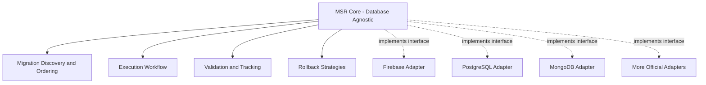

# Design Philosophy
{: .no_toc }

The principles and decisions that shape MSR's architecture.
{: .fs-6 .fw-300 }

## Table of contents
{: .no_toc .text-delta }

1. TOC
{:toc}

---

## Overview

MSR's design is guided by lessons learned across years of building and using migration tools in production environments. Every architectural decision serves a purpose born from real-world pain points.

This page explains the **why** behind MSR's architecture. For the history and evolution, see the [origin story](origin-story).

---

## Database Agnosticism

**Principle**: Separate *what* migrations do from *how* they interact with databases.

**Why it matters:**
- Use the same migration patterns across all databases
- Switch databases without rewriting migration infrastructure
- Core improvements benefit all adapters

**Implementation**: The `IDatabaseMigrationHandler` interface defines the contract. Adapters implement database-specific logic.

---

## Polyglot Migrations

**Principle**: Support multiple migration formats in the same project.

**Why it matters:**
- SQL is perfect for schema changes (simple, fast, works with standard tools)
- TypeScript/JavaScript enables complex logic (loops, conditionals, calling services)
- Different tasks need different tools

**Implementation**: MSR supports `.up.sql`/`.down.sql` files alongside TypeScript/JavaScript migration scripts. The loader system detects file types and handles them appropriately.

See: [SQL Migrations Guide](../guides/sql-migrations) | [Writing Migrations](../guides/writing-migrations)

---

## Built-in Safety Nets

**Principle**: Make safety automatic, not optional.

**Why it matters:**
- Manual backups are forgotten under time pressure
- Separate backup systems add complexity
- Recovery procedures should be tested with every migration

**Implementation**: MSR can automatically backup before migrations and rollback on failure. Multiple strategies available: BACKUP, DOWN, BOTH, or NONE.

See: [Backup & Restore Workflows](../guides/backup-restore-workflows) | [Rollback Strategies](../configuration/rollback-strategies)

---

## Programmable Architecture

**Principle**: Migrations should access your application's business logic.

**Why it matters:**
- Validate data using existing rules
- Trigger events or notifications
- Reuse repositories and services
- Keep business logic DRY

**Implementation**: The handler pattern allows injecting custom services. Migrations can access these services to call your application code.

See: [Database Handler Interface](../api/interfaces/database-handler) | [Writing Migrations](../guides/writing-migrations)

---

## Custom Validation

**Principle**: Enforce team-specific rules automatically.

**Why it matters:**
- Every team has standards (naming, reversibility, approval workflows)
- Manual enforcement is error-prone
- Catch mistakes in development, not production

**Implementation**: The `IMigrationValidator` interface lets you write custom validators. They run before migrations execute and can fail the process if rules are violated.

See: [Validation Guide](../customization/validation)

---

## Library-First Design

**Principle**: Return structured results instead of calling `process.exit()`.

**Why it matters:**
- Web servers need to continue running after migrations
- Serverless functions must return proper responses
- Test suites need to clean up gracefully
- Applications should handle errors contextually

**Implementation**: All executor methods return `MigrationResult` objects with `success`, `executed`, and `errors` properties. Your application decides how to handle the result.

See: [API Reference](../api/)

---

## Execution Summary

**Principle**: Provide structured, machine-readable output.

**Why it matters:**
- CI/CD pipelines need to parse results
- Monitoring systems need metrics
- Audit logs need details
- Exit codes aren't enough

**Implementation**: Results include timing, status, and errors for each migration in a structured format suitable for JSON logging and dashboard integration.

See: [Configuration](../configuration/)

---

## Cloud-Native Configuration

**Principle**: Support environment variables following 12-factor app principles.

**Why it matters:**
- Container deployments use environment variables
- Avoid building different images per environment
- Simplify CI/CD pipelines
- Standard practice for modern applications

**Implementation**: Complete `MSR_*` environment variable support for all configuration options (v0.5.0+).

See: [Environment Variables](../api/environment-variables/)

---

## Design Trade-offs

Every design decision involves trade-offs. Here are some we made consciously:

### Flexibility vs Simplicity

**Choice**: Favor flexibility
- Multiple rollback strategies instead of one
- Polyglot migrations instead of SQL-only
- Injectable services instead of fixed API

**Trade-off**: More concepts to learn initially, but adapts to more scenarios

### Type Safety vs Ease of Use

**Choice**: Full TypeScript support with interfaces
- Compile-time error detection
- IDE autocomplete and refactoring
- Clear contracts

**Trade-off**: Requires TypeScript knowledge, but catches errors early

### Database Agnostic vs Optimized

**Choice**: Database agnostic core with adapter pattern
- Works with any database
- Portable patterns

**Trade-off**: Can't leverage database-specific features in core, but adapters can optimize

---

## Further Reading

- **[Origin Story](origin-story)** - The history and evolution of these principles
- **[Getting Started](../getting-started)** - See these principles in practice
- **[API Reference](../api/)** - Detailed interface documentation
- **[Comparison](../comparison)** - How MSR differs from other tools
