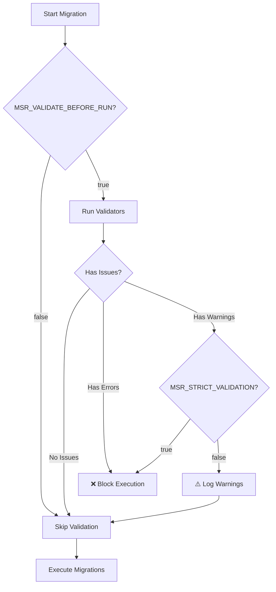

# Validation Environment Variables
{: .no_toc }

Environment variables for controlling migration validation behavior and strictness.
{: .fs-6 .fw-300 }

## Table of Contents
{: .no_toc .text-delta }

1. TOC
{:toc}

---

## Overview

Validation environment variables control how strictly MSR validates migrations before execution, helping catch potential issues early in development or CI/CD pipelines.

**Key Features:**
- Pre-execution validation to catch errors early
- Configurable strictness for different environments
- Perfect for CI/CD quality gates

---

## Variables

### MSR_VALIDATE_BEFORE_RUN

**Enable pre-execution validation**

- **Type**: `boolean`
- **Default**: `true`
- **Example**: `true`, `false`

Controls whether migrations are validated before execution begins. Recommended to keep enabled.

```bash
# Enable validation (recommended)
export MSR_VALIDATE_BEFORE_RUN=true

# Disable validation (not recommended)
export MSR_VALIDATE_BEFORE_RUN=false
```

**Programmatic Equivalent:**
```typescript
config.validateBeforeRun = true;
```

**What Gets Validated:**
- Migration file structure and naming
- Version number consistency
- Duplicate detection
- Down method presence (based on policy)
- Custom validator rules

**Use Cases:**
- **Production**: `true` - Always validate before executing
- **Development**: `true` - Catch issues early in development
- **CI/CD**: `true` - Quality gate before deployment

**See Also:**
- [Validation Settings](../../configuration/validation-settings)
- [Validation Guide](../../guides/validation)
- [Built-in Validators](../../customization/validation/built-in-validation)

---

### MSR_STRICT_VALIDATION

**Treat validation warnings as errors**

- **Type**: `boolean`
- **Default**: `false`
- **Example**: `true`, `false`

Controls whether validation warnings block migration execution or just produce log messages.

```bash
# Warnings are just warnings (default)
export MSR_STRICT_VALIDATION=false

# Treat warnings as errors
export MSR_STRICT_VALIDATION=true
```

**Programmatic Equivalent:**
```typescript
config.strictValidation = true;
```

**Behavior:**

| Mode | Warnings | Errors |
|------|----------|--------|
| **Strict (`true`)** | Block execution | Block execution |
| **Lenient (`false`)** | Log warning, continue | Block execution |

**Example Validation Issues:**

| Issue | Type | Strict Mode | Lenient Mode |
|-------|------|-------------|--------------|
| Missing down() method | Warning | ❌ Blocked | ⚠️ Warning |
| Duplicate timestamp | Error | ❌ Blocked | ❌ Blocked |
| Invalid file structure | Error | ❌ Blocked | ❌ Blocked |
| Naming convention | Warning | ❌ Blocked | ⚠️ Warning |

**Use Cases:**
- **CI/CD Pipeline**: `true` - Enforce maximum quality
- **Production**: `false` - Allow warnings, block errors only
- **Development**: `false` - Fast iteration with warnings

**See Also:**
- [Validation Settings](../../configuration/validation-settings#strictvalidation)
- [Strict Mode Guide](../../customization/validation/built-in-validation#strict-mode)

---

## Environment-Specific Configuration

### Development

Fast iteration with helpful warnings:

```bash
export MSR_VALIDATE_BEFORE_RUN=true
export MSR_STRICT_VALIDATION=false
```

### CI/CD

Maximum strictness for quality gates:

```bash
export MSR_VALIDATE_BEFORE_RUN=true
export MSR_STRICT_VALIDATION=true
```

### Production

Validate but allow warnings:

```bash
export MSR_VALIDATE_BEFORE_RUN=true
export MSR_STRICT_VALIDATION=false
```

---

## Complete Example

Production-ready validation configuration with environment detection:

```bash
# Always validate
export MSR_VALIDATE_BEFORE_RUN=true

# Strict mode in CI, lenient in production
export MSR_STRICT_VALIDATION=${CI:-false}
```

**Docker Example:**
```dockerfile
# Development
ENV MSR_VALIDATE_BEFORE_RUN=true \
    MSR_STRICT_VALIDATION=false

# CI/CD
ENV MSR_VALIDATE_BEFORE_RUN=true \
    MSR_STRICT_VALIDATION=true
```

**Kubernetes ConfigMap:**
```yaml
apiVersion: v1
kind: ConfigMap
metadata:
  name: msr-validation-config
data:
  MSR_VALIDATE_BEFORE_RUN: "true"
  MSR_STRICT_VALIDATION: "false"  # Adjust per environment
```

---

## Validation Flow



---

## Source Code

TypeScript enum definition: [`src/model/env/ValidationEnvVars.ts`](../../../src/model/env/ValidationEnvVars.ts)
