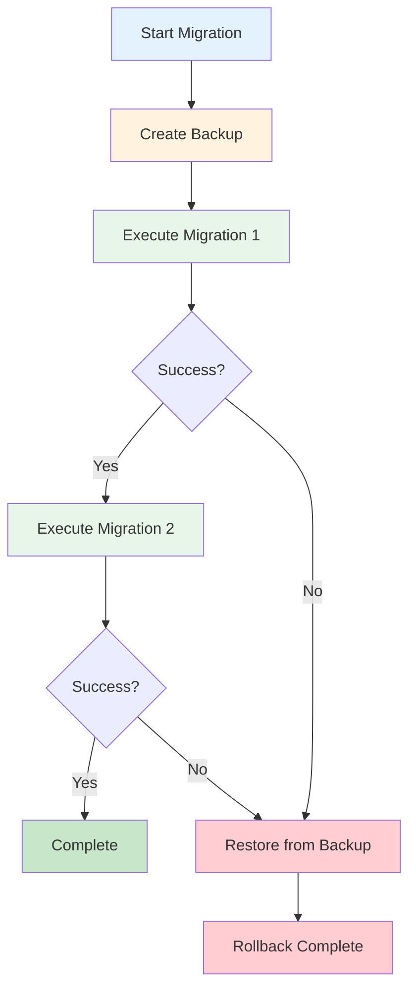
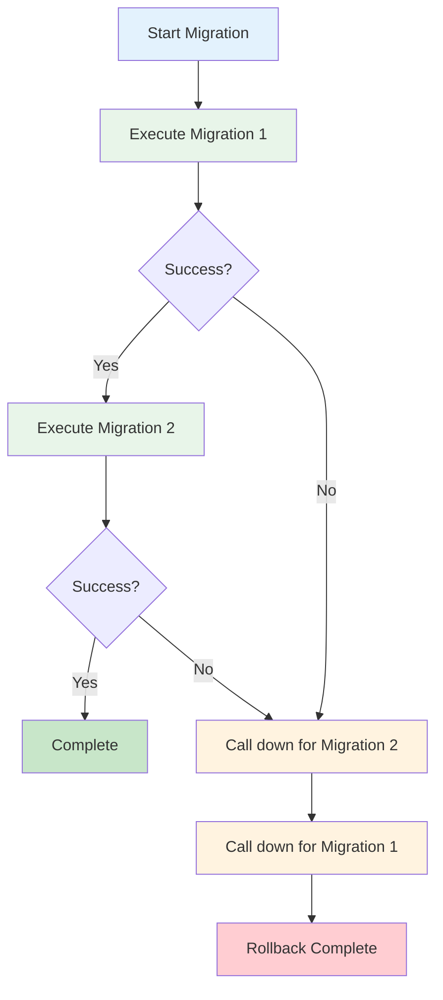
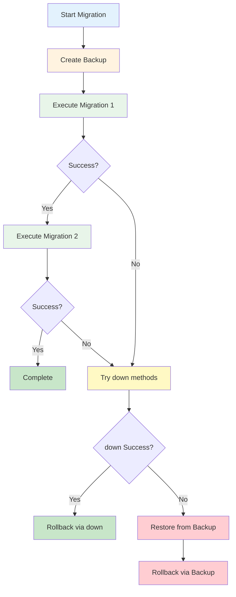

# Rollback Settings
{: .no_toc }

Configure how migrations rollback on failure
{: .fs-6 .fw-300 }

## Table of contents
{: .no_toc .text-delta }

1. TOC
{:toc}

---

## Overview

Rollback settings determine how MSR handles failures during migration execution. When a migration fails, MSR can:

- Restore from a backup
- Call `down()` methods in reverse order
- Try both approaches
- Do nothing (development only)

---

## rollbackStrategy

**Type:** `RollbackStrategy`
**Default:** `RollbackStrategy.BACKUP`

Determines how MSR handles rollback when a migration fails.

```typescript
import { RollbackStrategy } from '@migration-script-runner/core';

// Use backup/restore (default, backward compatible)
config.rollbackStrategy = RollbackStrategy.BACKUP;

// Use down() methods (no backup required)
config.rollbackStrategy = RollbackStrategy.DOWN;

// Try down() first, fallback to backup
config.rollbackStrategy = RollbackStrategy.BOTH;

// No rollback (dangerous - use only in development)
config.rollbackStrategy = RollbackStrategy.NONE;
```

---

## Strategy Comparison

Choose the right rollback strategy for your environment:

| Strategy | Safety | Performance | Storage | Requires Backup | Requires down() | Best For |
|----------|--------|-------------|---------|-----------------|-----------------|----------|
| **BACKUP** | 🟢 Highest | 🟡 Slower | 💾 High | ✅ Yes | ❌ No | **Production** (traditional) |
| **DOWN** | 🟡 Medium | 🟢 Fast | 💾 None | ❌ No | ✅ Yes | **Development** (fast iteration) |
| **BOTH** | 🟢 Highest | 🟢 Fast* | 💾 High | ✅ Yes | ⚠️ Recommended | **Production** (modern) |
| **NONE** | 🔴 None | 🟢 Fastest | 💾 None | ❌ No | ❌ No | **Append-only** systems |

*Fast if `down()` succeeds; falls back to slower backup restore if needed.

{: .tip }
> **Recommended**: Use `BOTH` strategy in production. It gives you fast rollback via `down()` methods with backup safety net.

{: .warning }
> Never use `NONE` strategy in production. It provides no rollback protection if migrations fail.

---

## Strategy Flow Diagrams

### BACKUP Strategy Flow

This flowchart shows how the BACKUP strategy creates a database backup before executing migrations, restoring it if any migration fails:



### DOWN Strategy Flow

This flowchart shows how the DOWN strategy executes migrations and calls down() methods in reverse order when a migration fails:



### BOTH Strategy Flow

This flowchart shows how the BOTH strategy combines both approaches - trying down() methods first, then falling back to backup restoration if needed:



---

## BACKUP Strategy

Traditional backup/restore approach.

```typescript
config.rollbackStrategy = RollbackStrategy.BACKUP;
```

### How It Works

1. Create database backup before migrations
2. Execute migrations sequentially
3. If any migration fails:
   - Restore database from backup
   - Call `onBeforeRestore` / `onAfterRestore` hooks
   - Delete applied migrations from tracking table

### Requirements

- Database handler must implement `IBackup` interface
- Sufficient disk space for backups
- Backup configuration (see [Backup Settings](backup-settings))

### Pros

- ✅ Guaranteed rollback (if backup succeeds)
- ✅ No `down()` methods required
- ✅ Complete database state restoration
- ✅ Backward compatible with MSR < v0.2

### Cons

- ❌ Slower (backup creation takes time)
- ❌ Requires disk space
- ❌ Not suitable for very large databases
- ❌ Cloud database backups can be expensive

### When to Use

- **Production** environments with reliable backups
- **Legacy migrations** without down() methods
- **Complex migrations** where down() is difficult
- **Small to medium** databases where backup speed is acceptable

### Example

```typescript
import { RollbackStrategy, BackupConfig } from '@migration-script-runner/core';

const config = new Config();
config.rollbackStrategy = RollbackStrategy.BACKUP;

// Configure backup
config.backup = new BackupConfig();
config.backup.folder = './backups';
config.backup.deleteBackup = true;
```

---

## DOWN Strategy

Use `down()` methods for rollback.

```typescript
config.rollbackStrategy = RollbackStrategy.DOWN;
```

### How It Works

1. No backup created
2. Execute migrations sequentially
3. If any migration fails:
   - Call `down()` on successfully executed migrations
   - Execute in reverse order
   - Call `onBeforeMigrationRollback` / `onAfterMigrationRollback` hooks

### Requirements

- All migrations must have `down()` methods
- `down()` methods must correctly reverse `up()` operations
- Recommended to set `downMethodPolicy = DownMethodPolicy.REQUIRED`

### Pros

- ✅ Fast rollback (no backup overhead)
- ✅ No disk space required
- ✅ Works with any database size
- ✅ Good for development iteration

### Cons

- ❌ Requires all migrations have `down()` methods
- ❌ down() bugs can cause failed rollback
- ❌ May not handle all edge cases
- ❌ Less safe than full backup restoration

### When to Use

- **Development** environments with fast iteration
- **Large databases** where backups are slow/expensive
- **Cloud databases** where backup costs are high
- **Modern migration workflows** with well-tested down() methods

### Example

```typescript
import { RollbackStrategy, DownMethodPolicy } from '@migration-script-runner/core';

const config = new Config();
config.rollbackStrategy = RollbackStrategy.DOWN;

// Enforce down() methods
config.downMethodPolicy = DownMethodPolicy.REQUIRED;
config.strictValidation = true;
```

---

## BOTH Strategy

Hybrid approach with fallback safety.

```typescript
config.rollbackStrategy = RollbackStrategy.BOTH;
```

### How It Works

1. Create database backup before migrations
2. Execute migrations sequentially
3. If any migration fails:
   - **First:** Try calling `down()` on executed migrations
   - **If down() succeeds:** Done (fast rollback)
   - **If down() fails:** Restore from backup (safe fallback)

### Requirements

- Database handler must implement `IBackup` interface
- Backup configuration required
- `down()` methods recommended but not required

### Pros

- ✅ Fast rollback when down() works
- ✅ Safe fallback if down() fails
- ✅ Best of both worlds
- ✅ Gradual migration from BACKUP to DOWN

### Cons

- ❌ Still requires backup overhead
- ❌ More complex rollback logic
- ❌ Backup created even if unused

### When to Use

- **Production** environments wanting fast rollback with safety net
- **Migration transition** from BACKUP to DOWN strategy
- **Mixed migrations** (some with down(), some without)
- **Risk-averse teams** wanting both speed and safety

### Example

```typescript
import { RollbackStrategy, DownMethodPolicy, BackupConfig } from '@migration-script-runner/core';

const config = new Config();
config.rollbackStrategy = RollbackStrategy.BOTH;

// Recommend but don't require down()
config.downMethodPolicy = DownMethodPolicy.RECOMMENDED;

// Configure backup as fallback
config.backup = new BackupConfig();
config.backup.folder = './backups';
config.backup.deleteBackup = true;
```

---

## NONE Strategy

No rollback on failure.

```typescript
config.rollbackStrategy = RollbackStrategy.NONE;
```

### How It Works

1. No backup created
2. Execute migrations sequentially
3. If any migration fails:
   - Log error
   - Leave database in partially-migrated state
   - No rollback attempted

### Requirements

None

### Pros

- ✅ Fastest (no backup or rollback)
- ✅ Simplest configuration
- ✅ Useful for debugging

### Cons

- ❌ **Dangerous** - leaves database in inconsistent state
- ❌ Manual recovery required after failure
- ❌ Not suitable for any production use

### When to Use

- **Local development only**
- **Debugging** specific migration failures
- **Temporary** troubleshooting

{: .warning }
**NEVER use NONE strategy in production!** It will leave your database in an inconsistent state on failure.

### Example

```typescript
const config = new Config();

// Only for local development
if (process.env.NODE_ENV === 'development' && process.env.DEBUG_MIGRATION) {
    config.rollbackStrategy = RollbackStrategy.NONE;
} else {
    config.rollbackStrategy = RollbackStrategy.BOTH;
}
```

---

## Choosing a Strategy

### Decision Matrix

Answer these questions to choose the right strategy:

1. **Do you have reliable backups?**
   - Yes → BACKUP or BOTH
   - No → DOWN or BOTH

2. **Do migrations have down() methods?**
   - All have down() → DOWN or BOTH
   - Some have down() → BOTH
   - None have down() → BACKUP

3. **Is database large (> 10GB)?**
   - Yes → DOWN or BOTH (prefer down() rollback)
   - No → BACKUP or BOTH

4. **Is this production?**
   - Yes → BACKUP or BOTH
   - No → DOWN (for speed)

5. **Need guaranteed rollback?**
   - Yes → BACKUP or BOTH
   - No → DOWN

### Recommendations by Environment

| Environment | Recommended Strategy | Reason |
|-------------|---------------------|---------|
| Development | `DOWN` | Fast iteration |
| Staging | `BOTH` | Test rollback scenarios |
| Production | `BOTH` or `BACKUP` | Safety with performance |
| CI/CD | `DOWN` | Fast testing |

---

## Strategy Examples

### Small Production Database

```typescript
// < 10GB database, reliable backups
config.rollbackStrategy = RollbackStrategy.BACKUP;
config.backup.folder = './backups';
```

### Large Production Database

```typescript
// > 10GB database, backups are slow
config.rollbackStrategy = RollbackStrategy.DOWN;
config.downMethodPolicy = DownMethodPolicy.REQUIRED;
```

### Hybrid Production

```typescript
// Want both speed and safety
config.rollbackStrategy = RollbackStrategy.BOTH;
config.downMethodPolicy = DownMethodPolicy.RECOMMENDED;
config.backup.folder = '/var/backups';
```

### Development

```typescript
// Fast iteration, no backup overhead
config.rollbackStrategy = RollbackStrategy.DOWN;
config.validateBeforeRun = true;  // Still validate!
```

---

## Interaction with Other Settings

### With downMethodPolicy

```typescript
// BACKUP strategy - down() not needed
config.rollbackStrategy = RollbackStrategy.BACKUP;
config.downMethodPolicy = DownMethodPolicy.OPTIONAL;  // Makes sense

// DOWN strategy - down() required
config.rollbackStrategy = RollbackStrategy.DOWN;
config.downMethodPolicy = DownMethodPolicy.REQUIRED;  // Makes sense

// BOTH strategy - down() recommended
config.rollbackStrategy = RollbackStrategy.BOTH;
config.downMethodPolicy = DownMethodPolicy.RECOMMENDED;  // Makes sense
```

### With Backup Configuration

```typescript
// BACKUP or BOTH - must configure backup
if (config.rollbackStrategy === RollbackStrategy.BACKUP ||
    config.rollbackStrategy === RollbackStrategy.BOTH) {
    config.backup = new BackupConfig();
    config.backup.folder = './backups';
}

// DOWN or NONE - backup config ignored
if (config.rollbackStrategy === RollbackStrategy.DOWN ||
    config.rollbackStrategy === RollbackStrategy.NONE) {
    // No backup configuration needed
}
```

### With Validation

```typescript
// Always validate, regardless of rollback strategy
config.validateBeforeRun = true;

// Strict validation with DOWN strategy
config.rollbackStrategy = RollbackStrategy.DOWN;
config.downMethodPolicy = DownMethodPolicy.REQUIRED;
config.strictValidation = true;
```

---

## Migration Guide

### From BACKUP to BOTH

Gradual transition with safety net:

```typescript
// Step 1: Change strategy, keep backups
config.rollbackStrategy = RollbackStrategy.BOTH;
config.downMethodPolicy = DownMethodPolicy.RECOMMENDED;

// Step 2: Add down() to new migrations
// Step 3: Monitor rollback performance

// Step 4: After confidence, consider DOWN strategy
// config.rollbackStrategy = RollbackStrategy.DOWN;
```

### From BOTH to DOWN

Remove backup overhead:

```typescript
// Step 1: Ensure all migrations have down()
config.downMethodPolicy = DownMethodPolicy.REQUIRED;
config.strictValidation = true;

// Step 2: Test rollback in staging
// Step 3: Switch to DOWN strategy
config.rollbackStrategy = RollbackStrategy.DOWN;

// Step 4: Remove backup configuration
// config.backup = undefined;
```

---

## Best Practices

### 1. Choose Based on Database Size

```typescript
// ✅ Good - consider database size
const dbSize = await getDatabaseSize();
config.rollbackStrategy = dbSize > 10_000_000_000  // 10GB
    ? RollbackStrategy.DOWN
    : RollbackStrategy.BOTH;
```

### 2. Always Validate

```typescript
// ✅ Good - validate regardless of strategy
config.validateBeforeRun = true;
```

### 3. Match Policy to Strategy

```typescript
// ✅ Good - policies match strategy
config.rollbackStrategy = RollbackStrategy.DOWN;
config.downMethodPolicy = DownMethodPolicy.REQUIRED;

// ❌ Bad - mismatch
config.rollbackStrategy = RollbackStrategy.DOWN;
config.downMethodPolicy = DownMethodPolicy.OPTIONAL;  // Won't check for down()!
```

### 4. Never Use NONE in Production

```typescript
// ✅ Good - safe check
if (process.env.NODE_ENV === 'production') {
    config.rollbackStrategy = RollbackStrategy.BOTH;
}

// ❌ Bad - dangerous
config.rollbackStrategy = RollbackStrategy.NONE;
```

---

## Related Documentation

- [Backup Settings](backup-settings) - Configure backups for BACKUP/BOTH strategies
- [Validation Settings](validation-settings) - Configure down() method validation
- [Configuration Overview](index) - All configuration options
- [Writing Migrations](../user-guides/writing-migrations) - Best practices including down() methods
