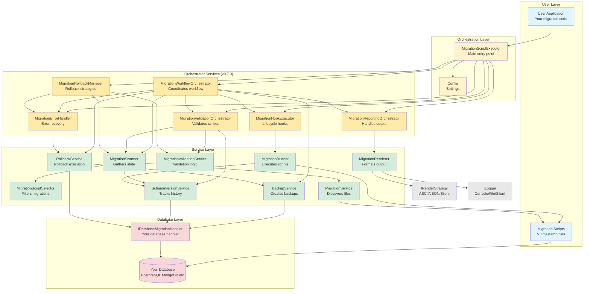

# Core Components
{: .no_toc }

Detailed documentation of MSR's core classes and services.
{: .fs-6 .fw-300 }

## Table of contents
{: .no_toc .text-delta }

1. TOC
{:toc}

---

## High-Level Architecture

This component diagram shows the relationships between MSR's core services and how they interact with your database handler:



**Layer Responsibilities:**
- **Blue (User Layer)**: Your application code and migration scripts
- **Yellow (Orchestration)**: Main entry point and configuration
- **Orange (Orchestrators - v0.7.0)**: Specialized orchestrators following Single Responsibility Principle
- **Green (Service Layer)**: Focused services with specific responsibilities
- **Pink (Database Layer)**: Your database handler and database
- **Gray (Output)**: Rendering and logging strategies

---

## Core Components

### MigrationScriptExecutor

**Purpose:** Main entry point that initializes and delegates to orchestrator services

**Responsibilities (v0.7.0 - Refactored):**
- Initialize all required services and orchestrators
- Provide public API (`up()`, `down()`, `list()`, `validate()`)
- Delegate workflow execution to `MigrationWorkflowOrchestrator`
- Manage dependency injection and service lifecycle
- Set up hooks, loggers, and transaction managers

**Architecture Evolution:**
- **v0.6.0 and earlier:** GOD class handling all concerns
- **v0.7.0:** Refactored - delegates to 6 specialized orchestrators

**Key Orchestrator Dependencies (v0.7.0):**
- `IMigrationWorkflowOrchestrator` - Coordinates migration workflow
- `IMigrationValidationOrchestrator` - Validates scripts before execution
- `IMigrationReportingOrchestrator` - Handles rendering and logging
- `IMigrationErrorHandler` - Error recovery and rollback decisions
- `IMigrationHookExecutor` - Lifecycle hook execution
- `IMigrationRollbackManager` - Rollback strategy execution

**Additional Service Dependencies:**
- `IBackupService`, `ISchemaVersionService`, `IRollbackService`
- `IMigrationService`, `IMigrationScanner`, `IMigrationRenderer`
- `MigrationScriptSelector`, `MigrationRunner`, `IMigrationValidationService`
- `ILoaderRegistry`, `ITransactionManager`, `ILogger`, `IMigrationHooks`

**Location:** `src/service/MigrationScriptExecutor.ts`

```typescript
// Example usage (public API unchanged)
const config = new Config();
const executor = new MigrationScriptExecutor({ handler,
    logger: new SilentLogger(),  // Optional DI
    backupService: customBackup  // Optional DI
});

const result = await executor.up();  // Delegates to workflowOrchestrator
```

---

## Orchestrator Services (v0.7.0)

The following orchestrators were extracted from MigrationScriptExecutor in v0.7.0 to follow the Single Responsibility Principle. Each handles a specific aspect of the migration workflow.

### MigrationWorkflowOrchestrator

**Purpose:** Coordinates the complete migration workflow from start to finish

**Responsibilities:**
- Orchestrate the full migration lifecycle: prepare → scan → validate → backup → execute → report
- Coordinate between validation, reporting, and hook orchestrators
- Handle both `migrateAll()` and `migrateToVersion()` workflows
- Execute dry-run mode with automatic rollback
- Detect and prevent hybrid migrations (SQL + TypeScript with transactions enabled)
- Manage error recovery and rollback coordination

**Key Methods:**
- `migrateAll()` - Execute all pending migrations
- `migrateToVersion(targetVersion)` - Migrate to specific version

**Workflow Steps:**
```
1. prepareForMigration() - Execute beforeMigrate setup script
2. scanAndValidate() - Scan filesystem, validate scripts, check transaction config
3. createBackupIfNeeded() - Create backup based on strategy
4. checkHybridMigrationsAndDisableTransactions() - Prevent SQL+TS conflicts
5. executePendingMigrations() or executeDryRun() - Run migrations
6. Report results via reportingOrchestrator
7. On error: delegate to errorHandler for rollback
```

**Location:** `src/service/MigrationWorkflowOrchestrator.ts`

**Example:**
```typescript
const workflowOrchestrator = new MigrationWorkflowOrchestrator({
    migrationScanner,
    validationOrchestrator,
    reportingOrchestrator,
    backupService,
    hookExecutor,
    errorHandler,
    // ... other dependencies
});

const result = await workflowOrchestrator.migrateAll();
```

---

### MigrationValidationOrchestrator

**Purpose:** Orchestrates all validation activities before migration execution

**Responsibilities:**
- Validate migration scripts (file existence, structure, naming)
- Validate migrated file integrity with checksum verification
- Validate transaction configuration against database capabilities
- Validate loader availability for detected file types
- Coordinate validation service for actual validation logic
- Render validation errors in user-friendly format

**Key Methods:**
- `validateMigrations(scripts)` - Validate pending migration scripts
- `validateMigratedFileIntegrity(scripts)` - Verify checksums of executed migrations
- `validateTransactionConfiguration(scripts)` - Check database supports transaction mode
- `validateLoaderAvailability(scripts)` - Ensure loaders exist for file types

**Validation Checks:**
```
File Validation:
- File exists on filesystem
- Filename follows Vxxxx_description pattern
- File is readable and loadable
- Duplicate timestamps detection

Integrity Validation (v0.6.0):
- Checksum matches database record
- File hasn't been modified since execution
- Missing files detection

Transaction Validation (v0.5.0):
- Database implements ITransactionalDB or ICallbackTransactionalDB
- Isolation level support verification
```

**Location:** `src/service/MigrationValidationOrchestrator.ts`

**Example:**
```typescript
const validationOrch = new MigrationValidationOrchestrator({
    validationService,
    logger,
    config,
    loaderRegistry,
    migrationScanner,
    schemaVersionService,
    handler
});

// Throws ValidationError if any issues found
await validationOrch.validateMigrations(pendingScripts);
```

---

### MigrationReportingOrchestrator

**Purpose:** Orchestrates all rendering and logging activities

**Responsibilities:**
- Render migration status tables (pending, migrated, ignored)
- Log migration progress and completion
- Handle dry-run mode logging
- Display transaction testing messages
- Log warnings (no pending migrations, backup not created, etc.)
- Coordinate between renderer and logger for consistent output

**Key Methods:**
- `renderMigrationStatus(scripts)` - Display migration state table
- `logMigrationComplete(result)` - Log success/failure summary
- `logDryRunMode()` - Display dry-run banner
- `logNoPendingMigrations()` - Warn when no migrations to execute
- `logDryRunTransactionTesting(mode)` - Log transaction test mode

**Output Coordination:**
```
Renderer → Formats tables/JSON/silent output
Logger → Writes to console/file/silent
Orchestrator → Coordinates timing and content
```

**Location:** `src/service/MigrationReportingOrchestrator.ts`

**Example:**
```typescript
const reportingOrch = new MigrationReportingOrchestrator({
    migrationRenderer,
    logger,
    config
});

// Render status table
reportingOrch.renderMigrationStatus(scripts);

// Log completion
reportingOrch.logMigrationComplete(result);
```

---

### MigrationErrorHandler

**Purpose:** Handles errors and orchestrates recovery strategies

**Responsibilities:**
- Catch and process migration errors
- Determine rollback strategy based on error type
- Coordinate with RollbackService for recovery
- Call lifecycle hooks (onError)
- Format error messages with context
- Decide whether to throw or return failure result

**Error Handling Strategy:**
```
1. Catch error from migration execution
2. Log error details with context
3. Call onError hook if present
4. Delegate to rollbackService for recovery
5. Return structured error result or re-throw
```

**Key Method:**
```typescript
async handleMigrationError(
    error: unknown,
    targetVersion: number | undefined,
    executedScripts: MigrationScript[],
    backupPath: string | undefined,
    errors: Error[]
): Promise<IMigrationResult>
```

**Location:** `src/service/MigrationErrorHandler.ts`

**Example:**
```typescript
const errorHandler = new MigrationErrorHandler({
    logger,
    hooks,
    rollbackService
});

try {
    await runMigrations();
} catch (error) {
    return await errorHandler.handleMigrationError(
        error,
        targetVersion,
        executedScripts,
        backupPath,
        errors
    );
}
```

---

### MigrationHookExecutor

**Purpose:** Executes lifecycle hooks around migration scripts

**Responsibilities:**
- Execute beforeAll/afterAll hooks for batch operations
- Execute beforeEach/afterEach hooks for individual scripts
- Wrap script execution with hook lifecycle
- Pass migration context to hooks (script info, metadata)
- Handle hook errors gracefully
- Delegate to MigrationRunner for actual script execution

**Hook Lifecycle:**
```
beforeAll(scripts)
  forEach script:
    beforeEach(script, info)
      runner.executeOne(script)  ← Actual execution
    afterEach(script, info)
afterAll(scripts)
```

**Key Method:**
```typescript
async executeWithHooks(
    scripts: MigrationScript[],
    alreadyExecuted: MigrationScript[]
): Promise<void>
```

**Location:** `src/service/MigrationHookExecutor.ts`

**Example:**
```typescript
const hookExecutor = new MigrationHookExecutor({
    runner,
    hooks
});

// Execute migrations with full hook lifecycle
await hookExecutor.executeWithHooks(
    pendingScripts,
    alreadyExecutedScripts
);
```

---

### MigrationRollbackManager

**Purpose:** Manages rollback operations for down migrations

**Responsibilities:**
- Execute down migrations (reverse order)
- Scan and validate scripts for rollback
- Handle version-specific rollback (downTo)
- Coordinate error handling during rollback
- Call lifecycle hooks during rollback
- Remove schema_version entries after successful rollback

**Rollback Workflow:**
```
1. Scan and gather migration state
2. Select scripts to rollback (getMigratedDownTo)
3. Initialize and validate scripts
4. Execute down() methods in reverse order
5. Remove from schema_version table
6. Call lifecycle hooks
7. Handle errors via errorHandler
```

**Key Method:**
```typescript
async down(targetVersion: number): Promise<IMigrationResult>
```

**Location:** `src/service/MigrationRollbackManager.ts`

**Example:**
```typescript
const rollbackManager = new MigrationRollbackManager({
    handler,
    schemaVersionService,
    migrationScanner,
    selector,
    logger,
    config,
    loaderRegistry,
    validationService,
    hooks,
    errorHandler
});

// Rollback to version 5 (reverses all migrations > 5)
const result = await rollbackManager.down(5);
```

---

### MigrationScriptSelector

**Purpose:** Determines which migrations should be executed or rolled back

**Responsibilities:**
- Compare discovered scripts with executed migrations
- Filter out already-executed migrations
- Identify out-of-order migrations (ignored)
- Return pending migrations (for normal execution)
- Select migrations for version-specific operations (migrateTo/downTo)
- Select migrations for rollback operations

**Key Methods:**
- `getPending(migrated, all)` - Returns scripts to execute
- `getIgnored(migrated, all)` - Returns outdated scripts
- `getPendingUpTo(migrated, all, targetVersion)` - Returns scripts to execute up to target version
- `getMigratedDownTo(migrated, targetVersion)` - Returns scripts to rollback to reach target version
- `getMigratedInRange(migrated, fromVersion, toVersion)` - Returns scripts in version range

**Algorithm (getPending):**
```
1. Find max timestamp of executed migrations
2. Get scripts not in executed list
3. Filter: only scripts newer than max timestamp
4. Result: pending migrations to execute
```

**Algorithm (getPendingUpTo):**
```
1. Get pending migrations using getPending()
2. Filter: only scripts with timestamp <= targetVersion
3. Sort by timestamp (chronological order)
4. Result: migrations to execute to reach target version
```

**Algorithm (getMigratedDownTo):**
```
1. Get all executed migrations
2. Filter: only scripts with timestamp > targetVersion
3. Sort by timestamp (reverse chronological order)
4. Result: migrations to rollback to reach target version
```

**Location:** `src/service/MigrationScriptSelector.ts`

**Example:**
```typescript
const selector = new MigrationScriptSelector();

// migrated = [V1, V2, V5]
// all = [V1, V2, V3, V5, V6]
const pending = selector.getPending(migrated, all);
// → [V6]  (V3 ignored because < V5)

const ignored = selector.getIgnored(migrated, all);
// → [V3]  (older than last executed V5)

// Version control examples
const pendingUpTo = selector.getPendingUpTo(migrated, all, 6);
// → [V6]  (only V6, up to version 6)

const toRollback = selector.getMigratedDownTo(migrated, 2);
// → [V5]  (rollback V5 to reach version 2)
```

---

### MigrationScanner

**Purpose:** Gathers complete migration state from multiple sources

**Responsibilities:**
- Query database for executed migrations (parallel)
- Scan filesystem for migration scripts (parallel)
- Coordinate selector to identify pending migrations
- Coordinate selector to identify ignored migrations
- Return complete IScripts object with all migration states

**Key Methods:**
- `scan()` - Returns complete migration state: `{ all, migrated, pending, ignored, executed }`

**Architecture Benefits:**
- **Single Responsibility** - Separates state gathering from execution logic
- **Parallel Execution** - Database and filesystem queries run concurrently for performance
- **Testability** - Easy to test scanning logic independently from execution
- **Reusability** - Can use scanner in other contexts (reporting, analytics, dry-runs)

**Location:** `src/service/MigrationScanner.ts`

**Example:**
```typescript
const scanner = new MigrationScanner(
    migrationService,
    schemaVersionService,
    selector,
    handler
);

const scripts = await scanner.scan();
// Returns: {
//   all: MigrationScript[],       // All scripts found on filesystem
//   migrated: MigrationScript[],  // Scripts already executed in DB
//   pending: MigrationScript[],   // Scripts to execute (newer than last)
//   ignored: MigrationScript[],   // Scripts skipped (older than last)
//   executed: MigrationScript[]   // Scripts executed in current run
// }
```

**Dynamic Configuration:**
The scanner accepts `handler` instead of `config` to ensure it always uses the current configuration. This is critical for integration tests that modify config dynamically.

```typescript
// Good: Dynamic config access
constructor(private readonly handler: IDatabaseMigrationHandler) {}
all: this.migrationService.readMigrationScripts(this.handler.cfg)

// Bad: Config snapshot (would break dynamic tests)
constructor(private readonly config: Config) {}
all: this.migrationService.readMigrationScripts(this.config)
```

---

### MigrationRunner

**Purpose:** Executes migration scripts with metadata tracking

**Responsibilities:**
- Execute scripts sequentially in chronological order
- Record execution timing (startedAt, finishedAt)
- Capture current username
- Save metadata to schema version table
- Stop on first error (fail-fast)

**Key Methods:**
- `execute(scripts)` - Execute multiple scripts in order
- `executeOne(script)` - Execute single script with metadata

**Execution Flow:**
```
For each script (in timestamp order):
  1. Set username (from OS)
  2. Record startedAt timestamp
  3. Call script.up(db, info, handler)
  4. Record finishedAt timestamp
  5. Save to schema_version table
  6. Continue to next (or stop on error)
```

**Location:** `src/service/MigrationRunner.ts`

**Example:**
```typescript
const runner = new MigrationRunner(handler, schemaVersionService, logger);

const scripts = [script1, script2, script3];
const executed = await runner.execute(scripts);
// → Scripts executed in order, metadata recorded
```

---

### RollbackService

**Purpose:** Orchestrate rollback operations based on configured strategy

**Responsibilities:**
- Determine if backup should be created based on strategy and mode
- Execute rollback using one of four strategies (BACKUP, DOWN, BOTH, NONE)
- Handle backup mode logic (FULL, CREATE_ONLY, RESTORE_ONLY, MANUAL)
- Coordinate with BackupService for backup/restore operations
- Call lifecycle hooks during rollback (onBeforeRestore, onAfterRestore)

**Location:** `src/service/RollbackService.ts`

**Rollback Strategies:**
- **BACKUP** - Restore from backup file
- **DOWN** - Call down() methods in reverse order
- **BOTH** - Try DOWN first, fallback to BACKUP if it fails
- **NONE** - No rollback (logs warning)

**Backup Modes (affect BACKUP/BOTH strategies):**
- **FULL** - Create backup before migration, restore on failure
- **CREATE_ONLY** - Create backup but don't restore on failure
- **RESTORE_ONLY** - Don't create backup, restore from existing backup path
- **MANUAL** - Don't create or restore (use createBackup/restoreFromBackup methods manually)

**Key Method:**
```typescript
async rollback(
    executedScripts: MigrationScript[],
    backupPath?: string
): Promise<void>
```

**Example Usage:**
```typescript
const rollbackService = new RollbackService(
    handler,
    config,
    backupService,
    logger,
    hooks
);

try {
    await runMigrations();
} catch (error) {
    // Automatically rollback using configured strategy
    await rollbackService.rollback(executedScripts, backupPath);
}
```

---

### BackupService

**Purpose:** Create and manage database backup files

**Responsibilities:**
- Create backup by calling handler.backup.backup()
- Write backup data to disk with timestamp
- Restore backup by calling handler.backup.restore()
- Delete backup after success or cleanup
- Handle backup file lifecycle

**Location:** `src/service/BackupService.ts`

**Note:** Used by RollbackService when rollbackStrategy is BACKUP or BOTH.

**Workflow (BACKUP strategy - orchestrated by RollbackService):**
```
migrate() {
  if (rollbackService.shouldCreateBackup()) {
    backup()         // ← BackupService
  }
  try {
    run migrations
    deleteBackup()   // ← Success: remove backup
  } catch (err) {
    rollbackService.rollback(executedScripts, backupPath)
    // → RollbackService calls restore() via BackupService
  }
}
```

**Workflow (DOWN strategy - orchestrated by RollbackService):**
```
migrate() {
  // No backup created (shouldCreateBackup() returns false)
  try {
    run migrations
  } catch (err) {
    rollbackService.rollback(executedScripts, backupPath)
    // → RollbackService calls down() on all attempted migrations
  }
}
```

**Workflow (BOTH strategy - orchestrated by RollbackService):**
```
migrate() {
  if (rollbackService.shouldCreateBackup()) {
    backup()         // ← BackupService
  }
  try {
    run migrations
    deleteBackup()   // ← Success: remove backup
  } catch (err) {
    rollbackService.rollback(executedScripts, backupPath)
    // → RollbackService tries down() first, falls back to backup restore if down() fails
    }
  }
}
```

---

### SchemaVersionService

**Purpose:** Track migration history in database

**Responsibilities:**
- Initialize schema_version table
- Save executed migration metadata
- Retrieve migration history
- Validate table structure

**Table Structure:**
```sql
CREATE TABLE schema_version (
  timestamp BIGINT PRIMARY KEY,
  name VARCHAR(255),
  username VARCHAR(255),
  started_at BIGINT,
  finished_at BIGINT,
  result TEXT
);
```

**Location:** `src/service/SchemaVersionService.ts`

---

### MigrationService

**Purpose:** Discover and load migration script files

**Responsibilities:**
- Scan migrations folder for files
- Parse filenames (extract timestamps)
- Load migration modules
- Validate migration structure

**Filename Format:**
```
V{timestamp}_{description}.{ts|js}
Example: V202311020036_create_users_table.ts
```

**Location:** `src/service/MigrationService.ts`

---

### MigrationRenderer

**Purpose:** Render migration information using pluggable strategies

**Responsibilities:**
- Delegate rendering to configured strategy (ASCII tables, JSON, silent)
- Display figlet banner via strategy
- Coordinate output formatting across different formats
- Show execution status in various output formats

**Location:** `src/service/MigrationRenderer.ts`

**Supported Strategies:**
- `AsciiTableRenderStrategy` - ASCII tables with formatted timestamps and durations
- `JsonRenderStrategy` - Structured JSON output (pretty or compact)
- `SilentRenderStrategy` - No output (for testing and library usage)
- Custom strategies via `IRenderStrategy` interface

---

