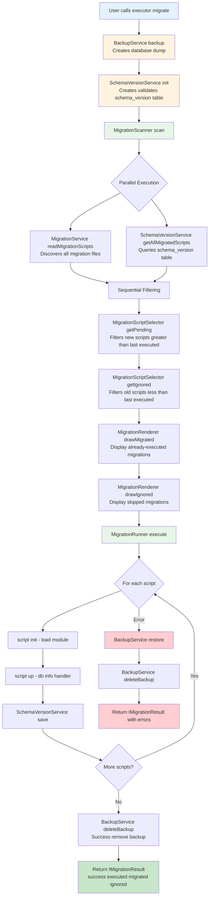

# Data Flow
{: .no_toc }

How data moves through the Migration Script Runner system.
{: .fs-6 .fw-300 }

## Table of contents
{: .no_toc .text-delta }

1. TOC
{:toc}

---

## Data Flow

### Complete Migration Workflow

This flowchart shows the complete data flow through MSR from user invocation to result:



---

## Class Diagram

```
┌─────────────────────────────────────────────────────────────────┐
│                   MigrationScriptExecutor                        │
├─────────────────────────────────────────────────────────────────┤
│ - handler: IDatabaseMigrationHandler                            │
│ - backupService: IBackupService                                 │
│ - schemaVersionService: ISchemaVersionService                   │
│ - migrationService: IMigrationService                           │
│ - migrationRenderer: IMigrationRenderer                         │
│ - migrationScanner: IMigrationScanner                           │
│ - selector: MigrationScriptSelector                             │
│ - runner: MigrationRunner                                       │
│ - logger: ILogger                                               │
├─────────────────────────────────────────────────────────────────┤
│ + migrate(): Promise<IMigrationResult>                          │
│ + list(number?: number): Promise<void>                          │
└─────────────────────────────────────────────────────────────────┘
                             │
                             │ delegates to
                             │
        ┌────────────────────┼────────────────────┐
        │                    │                    │
        ▼                    ▼                    ▼
┌──────────────────┐  ┌──────────────┐  ┌──────────────────────┐
│ MigrationScanner │  │ MigrationScrip│  │  MigrationRunner     │
├──────────────────┤  │ tSelector     │  ├──────────────────────┤
│ - migrationService│ ├──────────────┤  │ - handler            │
│ - schemaVersion   │  │ (stateless)  │  │ - schemaVersionService│
│   Service         │  ├──────────────┤  │ - logger             │
│ - selector        │  │ + getPending()│  ├──────────────────────┤
│ - handler         │  │ + getIgnored()│  │ + execute()          │
├──────────────────┤  └──────────────┘  │ + executeOne()       │
│ + scan()         │                     └──────────────────────┘
└──────────────────┘

┌──────────────────────────────────────────────────────────────┐
│                     Supporting Services                       │
├──────────────────────────┬──────────────────┬────────────────┤
│   BackupService          │ SchemaVersion    │ MigrationService│
│   • backup()             │ Service          │ • readMigration │
│   • restore()            │ • init()         │   Scripts()     │
│   • deleteBackup()       │ • save()         │ • parseFilename()│
│                          │ • getAllMigrated │                 │
└──────────────────────────┴──────────────────┴─────────────────┘
```

---

