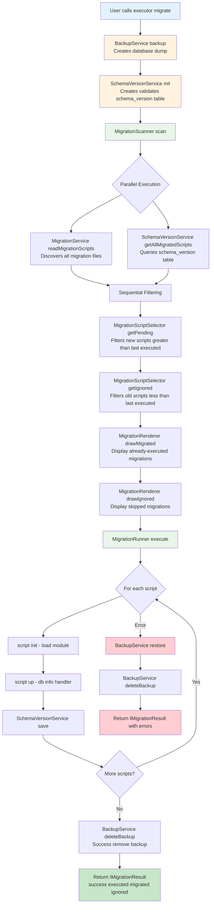
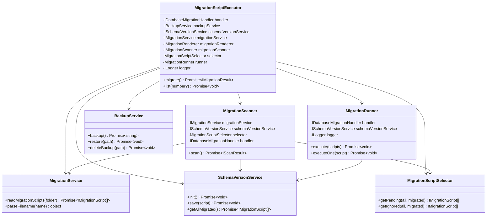

# Data Flow
{: .no_toc }

How data moves through the Migration Script Runner system.
{: .fs-6 .fw-300 }

## Table of contents
{: .no_toc .text-delta }

1. TOC
{:toc}

---

## Data Flow

### Complete Migration Workflow

This flowchart shows the complete data flow through MSR from user invocation to result:

---

## Class Diagram

---

