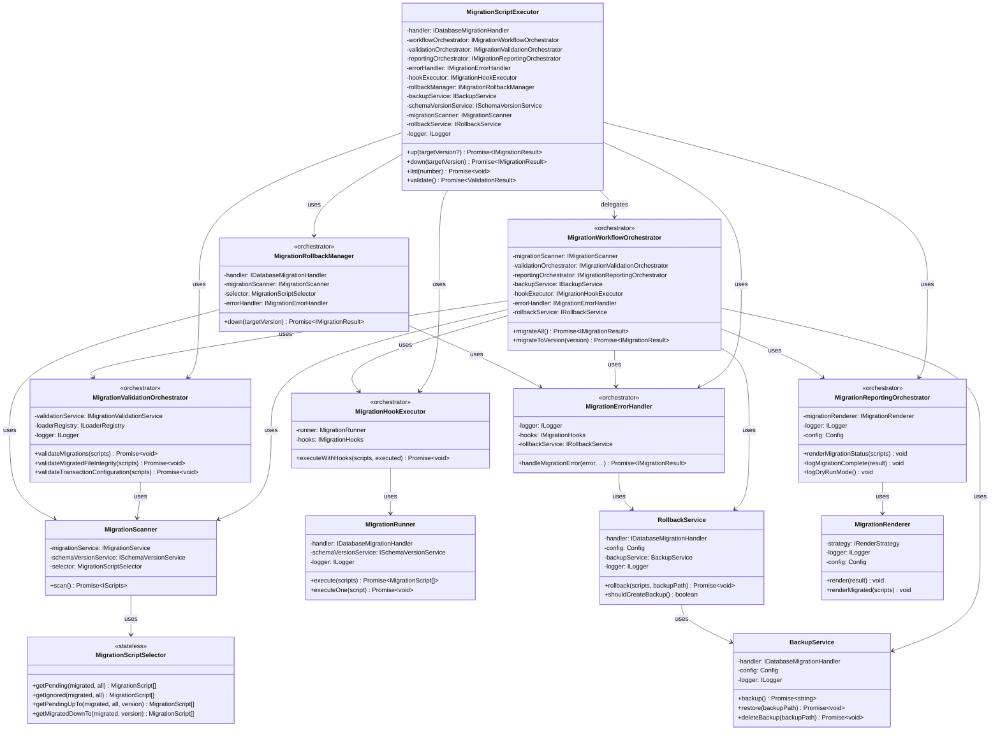

# Design Patterns
{: .no_toc }

Architectural patterns and design decisions in MSR.
{: .fs-6 .fw-300 }

## Table of contents
{: .no_toc .text-delta }

1. TOC
{:toc}

---

## Class Diagram

This UML class diagram shows the main classes, their properties, methods, and relationships (v0.7.0 - includes new orchestrators):



---

## Orchestrator Pattern

MSR uses the **Orchestrator Pattern** to break down complex workflows into specialized coordinators that each handle a specific aspect of the migration process.

### Pattern Overview

Instead of a single class handling all migration concerns, MSR delegates to specialized orchestrators:

```
MigrationScriptExecutor (Main Entry Point)
├── MigrationWorkflowOrchestrator
│   └── Coordinates: prepare → scan → validate → backup → execute → report
├── MigrationValidationOrchestrator
│   └── Orchestrates: file validation, integrity checks, transaction validation
├── MigrationReportingOrchestrator
│   └── Coordinates: rendering tables, logging progress, status updates
├── MigrationErrorHandler
│   └── Handles: error recovery, rollback decisions, hook notifications
├── MigrationHookExecutor
│   └── Executes: beforeAll/afterAll/beforeEach/afterEach lifecycle hooks
└── MigrationRollbackManager
    └── Manages: down migrations, version-specific rollbacks
```

### Benefits

- ✅ **Single Responsibility** - Each orchestrator has one clear purpose
- ✅ **Testability** - Easy to test each orchestrator in isolation
- ✅ **Maintainability** - Changes to workflow don't affect error handling
- ✅ **Readability** - Clear separation of concerns
- ✅ **Extensibility** - Easy to add new orchestrators without modifying existing ones

### Example: Workflow Delegation

```typescript
class MigrationScriptExecutor {
    // Delegates to specialized orchestrator
    async up(targetVersion?: number) {
        await this.checkDatabaseConnection();

        if (targetVersion !== undefined) {
            return this.workflowOrchestrator.migrateToVersion(targetVersion);
        }

        return this.workflowOrchestrator.migrateAll();
    }
}
```

### Internal vs Public Services

**Important:** Orchestrators are **internal services** (not exposed in public API):

```typescript
// ✅ PUBLIC - Users can inject these:
const executor = new MigrationScriptExecutor({
    handler,
    logger: customLogger,           // Public service
    backupService: customBackup,    // Public service
    renderStrategy: customStrategy  // Public service
});

// ❌ INTERNAL - Users cannot inject orchestrators:
//    (Orchestrators are created internally and coordinate services)
```

This design keeps the public API stable while allowing internal improvements for maintainability.

---

## Dependency Injection

MSR supports optional dependency injection for all services, enabling:
- **Testing** - Mock services for unit tests
- **Customization** - Replace default implementations
- **Extension** - Add new functionality

### Default vs Custom Dependencies

```typescript
// Default (uses built-in dependencies)
const config = new Config();
const executor = new MigrationScriptExecutor({ handler , config });
// Uses: ConsoleLogger, BackupService, SchemaVersionService, etc.

// Custom dependencies
const executor2 = new MigrationScriptExecutor({ handler, 
    logger: new SilentLogger(),          // Custom logger
    backupService: new S3BackupService(), // Custom backup
    renderStrategy: new JsonRenderStrategy()  // Custom render strategy
});
```

### Dependency Graph

This diagram shows the dependency injection hierarchy and how services are composed:

```mermaid
graph TD
    Executor[MigrationScriptExecutor]

    Executor --> Logger[ILogger<br/>default: ConsoleLogger]

    Executor --> Backup[IBackupService<br/>default: BackupService]
    Backup --> Logger2[ILogger]

    Executor --> Schema[ISchemaVersionService<br/>default: SchemaVersionService]
    Schema --> DAO[ISchemaVersionDAO<br/>from handler]

    Executor --> Migration[IMigrationService<br/>default: MigrationService]
    Migration --> Logger3[ILogger]

    Executor --> Renderer[IMigrationRenderer<br/>default: MigrationRenderer]
    Renderer --> Strategy[IRenderStrategy<br/>default: AsciiTableRenderStrategy]
    Strategy --> Logger4[ILogger]

    Executor --> Scanner[IMigrationScanner<br/>default: MigrationScanner]
    Scanner --> Migration2[IMigrationService]
    Scanner --> Schema2[ISchemaVersionService]
    Scanner --> Selector[MigrationScriptSelector]
    Scanner --> Handler[IDatabaseMigrationHandler]

    Executor --> Selector2[MigrationScriptSelector<br/>always created]
    Selector2 --> Stateless[stateless, no dependencies]

    Executor --> Runner[MigrationRunner<br/>always created]
    Runner --> Handler2[IDatabaseMigrationHandler]
    Runner --> Schema3[ISchemaVersionService]
    Runner --> Logger5[ILogger]

    Executor --> Rollback[RollbackService<br/>always created]
    Rollback --> Backup2[BackupService]

    style Executor fill:#fff3cd
    style Logger fill:#d4edda
    style Backup fill:#d4edda
    style Schema fill:#d4edda
    style Migration fill:#d4edda
    style Renderer fill:#d4edda
    style Scanner fill:#d4edda
    style Selector2 fill:#d4edda
    style Runner fill:#d4edda
    style Rollback fill:#d4edda
    style Strategy fill:#e8e8e8
    style Handler fill:#f8d7da
```



---

## Layer Responsibilities

### Layer 1: Orchestration
**Class:** `MigrationScriptExecutor`
**Role:** Coordinates workflow, handles errors, manages lifecycle

### Layer 2: Business Logic
**Classes:** `MigrationScriptSelector`, `MigrationRunner`
**Role:** Core migration logic - filtering and execution

### Layer 3: Services
**Classes:** `BackupService`, `SchemaVersionService`, `MigrationService`, `MigrationRenderer`
**Role:** Specialized operations - backup, tracking, discovery, display

### Layer 4: Models
**Classes:** `MigrationScript`, `Config`, `BackupConfig`
**Role:** Data structures and configuration

### Layer 5: Interfaces
**Interfaces:** `IDB`, `IDatabaseMigrationHandler`, `ILogger`, etc.
**Role:** Contracts and abstraction boundaries

### Layer 6: Database Handlers
**User-provided:** PostgreSQL, MySQL, MongoDB handlers
**Role:** Database-specific implementations

---

## Extension Points

### Custom Logger

```typescript
import { ILogger } from '@migration-script-runner/core';

class CloudLogger implements ILogger {
    log(message: string) {
        sendToCloudWatch(message);
    }
    // ... implement other methods
}

const executor = new MigrationScriptExecutor({ handler, 
    logger: new CloudLogger()
});
```

### Custom Backup

```typescript
import { IBackupService } from '@migration-script-runner/core';

class S3BackupService implements IBackupService {
    async backup() {
        const dump = await createDump();
        await s3.upload(dump);
    }
    // ... implement restore, deleteBackup
}

const executor = new MigrationScriptExecutor({ handler, 
    backupService: new S3BackupService()
});
```

### Custom Render Strategy

```typescript
import { IRenderStrategy, JsonRenderStrategy } from '@migration-script-runner/core';

// Use built-in JSON render strategy
const executor = new MigrationScriptExecutor({ handler,
    renderStrategy: new JsonRenderStrategy(true)  // pretty-printed JSON
});

// Or create a custom render strategy
class CustomRenderStrategy implements IRenderStrategy {
    renderMigrated(scripts, handler, limit) {
        console.log('Custom output:', scripts);
    }
    // ... implement other methods
}

const executor2 = new MigrationScriptExecutor({ handler,
    renderStrategy: new CustomRenderStrategy()
});
```

---

