# Design Patterns
{: .no_toc }

Architectural patterns and design decisions in MSR.
{: .fs-6 .fw-300 }

## Table of contents
{: .no_toc .text-delta }

1. TOC
{:toc}

---

## Class Diagram

This UML class diagram shows the main classes, their properties, methods, and relationships (v0.7.0 - includes new orchestrators):

```mermaid
classDiagram
    class MigrationScriptExecutor {
        #config: Config
        #handler: IDatabaseMigrationHandler
        #loaderRegistry: ILoaderRegistry
        -hooks: IMigrationHooks
        #core: CoreServices
        #execution: ExecutionServices
        #output: OutputServices
        #orchestration: OrchestrationServices
        +up(targetVersion?) Promise~IMigrationResult~
        +down(targetVersion) Promise~IMigrationResult~
        +list(number) Promise~void~
        +validate() Promise~ValidationResult~
        +createBackup() Promise~string~
        +restoreFromBackup(path?) Promise~void~
        +deleteBackup() void
        #checkDatabaseConnection() Promise~void~
    }

    class CoreServices {
        <<facade>>
        +scanner: IMigrationScanner
        +schemaVersion: ISchemaVersionService
        +migration: IMigrationService
        +validation: IMigrationValidationService
        +backup: IBackupService
        +rollback: IRollbackService
    }

    class ExecutionServices {
        <<facade>>
        +selector: MigrationScriptSelector
        +runner: MigrationRunner
        +transactionManager: ITransactionManager
    }

    class OutputServices {
        <<facade>>
        +logger: ILogger
        +renderer: IMigrationRenderer
    }

    class OrchestrationServices {
        <<facade>>
        +workflow: IMigrationWorkflowOrchestrator
        +validation: IMigrationValidationOrchestrator
        +reporting: IMigrationReportingOrchestrator
        +error: IMigrationErrorHandler
        +hooks: IMigrationHookExecutor
        +rollback: IMigrationRollbackManager
    }

    class MigrationWorkflowOrchestrator {
        <<orchestrator>>
        -migrationScanner: IMigrationScanner
        -validationOrchestrator: IMigrationValidationOrchestrator
        -reportingOrchestrator: IMigrationReportingOrchestrator
        -backupService: IBackupService
        -hookExecutor: IMigrationHookExecutor
        -errorHandler: IMigrationErrorHandler
        -rollbackService: IRollbackService
        +migrateAll() Promise~IMigrationResult~
        +migrateToVersion(version) Promise~IMigrationResult~
    }

    class MigrationValidationOrchestrator {
        <<orchestrator>>
        -validationService: IMigrationValidationService
        -loaderRegistry: ILoaderRegistry
        -logger: ILogger
        +validateMigrations(scripts) Promise~void~
        +validateMigratedFileIntegrity(scripts) Promise~void~
        +validateTransactionConfiguration(scripts) Promise~void~
    }

    class MigrationReportingOrchestrator {
        <<orchestrator>>
        -migrationRenderer: IMigrationRenderer
        -logger: ILogger
        -config: Config
        +renderMigrationStatus(scripts) void
        +logMigrationComplete(result) void
        +logDryRunMode() void
    }

    class MigrationErrorHandler {
        <<orchestrator>>
        -logger: ILogger
        -hooks: IMigrationHooks
        -rollbackService: IRollbackService
        +handleMigrationError(error, ...) Promise~IMigrationResult~
    }

    class MigrationHookExecutor {
        <<orchestrator>>
        -runner: MigrationRunner
        -hooks: IMigrationHooks
        +executeWithHooks(scripts, executed) Promise~void~
    }

    class MigrationRollbackManager {
        <<orchestrator>>
        -handler: IDatabaseMigrationHandler
        -migrationScanner: IMigrationScanner
        -selector: MigrationScriptSelector
        -errorHandler: IMigrationErrorHandler
        +down(targetVersion) Promise~IMigrationResult~
    }

    class MigrationScanner {
        -migrationService: IMigrationService
        -schemaVersionService: ISchemaVersionService
        -selector: MigrationScriptSelector
        +scan() Promise~IScripts~
    }

    class MigrationScriptSelector {
        <<stateless>>
        +getPending(migrated, all) MigrationScript[]
        +getIgnored(migrated, all) MigrationScript[]
        +getPendingUpTo(migrated, all, version) MigrationScript[]
        +getMigratedDownTo(migrated, version) MigrationScript[]
    }

    class MigrationRunner {
        -handler: IDatabaseMigrationHandler
        -schemaVersionService: ISchemaVersionService
        -logger: ILogger
        +execute(scripts) Promise~MigrationScript[]~
        +executeOne(script) Promise~void~
    }

    class BackupService {
        -handler: IDatabaseMigrationHandler
        -config: Config
        -logger: ILogger
        +backup() Promise~string~
        +restore(backupPath) Promise~void~
        +deleteBackup(backupPath) Promise~void~
    }

    class RollbackService {
        -handler: IDatabaseMigrationHandler
        -config: Config
        -backupService: BackupService
        -logger: ILogger
        +rollback(scripts, backupPath) Promise~void~
        +shouldCreateBackup() boolean
    }

    class MigrationRenderer {
        -strategy: IRenderStrategy
        -logger: ILogger
        -config: Config
        +render(result) void
        +renderMigrated(scripts) void
    }

    %% Main executor uses facades (v0.7.0 Facade Pattern)
    MigrationScriptExecutor *-- CoreServices : contains
    MigrationScriptExecutor *-- ExecutionServices : contains
    MigrationScriptExecutor *-- OutputServices : contains
    MigrationScriptExecutor *-- OrchestrationServices : contains

    %% Facades group related services (v0.7.0 Facade Pattern)
    CoreServices o-- MigrationScanner : groups
    CoreServices o-- BackupService : groups
    CoreServices o-- RollbackService : groups

    ExecutionServices o-- MigrationScriptSelector : groups
    ExecutionServices o-- MigrationRunner : groups

    OutputServices o-- MigrationRenderer : groups

    OrchestrationServices o-- MigrationWorkflowOrchestrator : groups
    OrchestrationServices o-- MigrationValidationOrchestrator : groups
    OrchestrationServices o-- MigrationReportingOrchestrator : groups
    OrchestrationServices o-- MigrationErrorHandler : groups
    OrchestrationServices o-- MigrationHookExecutor : groups
    OrchestrationServices o-- MigrationRollbackManager : groups

    %% Workflow orchestrator coordinates (v0.7.0 - owns executeBeforeMigrate)
    MigrationWorkflowOrchestrator --> MigrationScanner : uses
    MigrationWorkflowOrchestrator --> MigrationValidationOrchestrator : uses
    MigrationWorkflowOrchestrator --> MigrationReportingOrchestrator : uses
    MigrationWorkflowOrchestrator --> MigrationHookExecutor : uses
    MigrationWorkflowOrchestrator --> MigrationErrorHandler : uses
    MigrationWorkflowOrchestrator --> BackupService : uses
    MigrationWorkflowOrchestrator --> RollbackService : uses

    %% Other orchestrator dependencies
    MigrationValidationOrchestrator --> MigrationScanner : uses
    MigrationReportingOrchestrator --> MigrationRenderer : uses
    MigrationHookExecutor --> MigrationRunner : uses
    MigrationErrorHandler --> RollbackService : uses
    MigrationRollbackManager --> MigrationScanner : uses
    MigrationRollbackManager --> MigrationErrorHandler : uses

    %% Service dependencies
    MigrationScanner --> MigrationScriptSelector : uses
    RollbackService --> BackupService : uses
```



---

## Orchestrator Pattern

MSR uses the **Orchestrator Pattern** to break down complex workflows into specialized coordinators that each handle a specific aspect of the migration process.

### Pattern Overview

Instead of a single class handling all migration concerns, MSR delegates to specialized orchestrators:

```
MigrationScriptExecutor (Main Entry Point)
├── MigrationWorkflowOrchestrator
│   └── Coordinates: prepare → executeBeforeMigrate → scan → validate → backup → execute → report
├── MigrationValidationOrchestrator
│   └── Orchestrates: file validation, integrity checks, transaction validation
├── MigrationReportingOrchestrator
│   └── Coordinates: rendering tables, logging progress, status updates
├── MigrationErrorHandler
│   └── Handles: error recovery, rollback decisions, hook notifications
├── MigrationHookExecutor
│   └── Executes: beforeAll/afterAll/beforeEach/afterEach lifecycle hooks
└── MigrationRollbackManager
    └── Manages: down migrations, version-specific rollbacks
```

### Benefits

- ✅ **Single Responsibility** - Each orchestrator has one clear purpose
- ✅ **Testability** - Easy to test each orchestrator in isolation
- ✅ **Maintainability** - Changes to workflow don't affect error handling
- ✅ **Readability** - Clear separation of concerns
- ✅ **Extensibility** - Easy to add new orchestrators without modifying existing ones

### Example: Workflow Delegation

```typescript
class MigrationScriptExecutor {
    // Delegates to specialized orchestrator
    async up(targetVersion?: number) {
        await this.checkDatabaseConnection();

        if (targetVersion !== undefined) {
            return this.workflowOrchestrator.migrateToVersion(targetVersion);
        }

        return this.workflowOrchestrator.migrateAll();
    }
}
```

### Service Encapsulation (v0.7.0)

**Important:** All internal services and orchestrators are **encapsulated within facades** (not exposed as public properties):

```typescript
// ✅ PUBLIC - Users can inject service implementations via dependencies:
const executor = new MigrationScriptExecutor({
    handler,
    logger: customLogger,           // Injected service
    backupService: customBackup,    // Injected service
    renderStrategy: customStrategy  // Injected strategy
});

// ❌ NOT EXPOSED - Services grouped in protected facades (v0.7.0):
// executor.backupService         // REMOVED in v0.7.0
// executor.migrationScanner      // REMOVED in v0.7.0
// executor.validationService     // REMOVED in v0.7.0

// ✅ ADAPTERS - Can extend and access protected facades:
class CustomExecutor extends MigrationScriptExecutor {
    async customOperation() {
        const scripts = await this.core.scanner.scan();      // Protected access
        this.output.logger.info('Custom operation');         // Protected access
        return this.orchestration.workflow.migrateAll();     // Protected access
    }
}
```

**Benefits:**
- **Better Encapsulation**: Services not exposed as public API
- **Adapter Extensibility**: Protected facades allow adapter customization
- **v0.7.0 Breaking Change**: Direct service access removed (e.g., `executor.backupService` no longer works)
- **Workflow Ownership**: `executeBeforeMigrate()` now owned by `MigrationWorkflowOrchestrator` (eliminates circular dependency)

This design keeps the public API minimal while enabling adapter extensibility through protected facades.

---

## Facade Pattern

**New in v0.7.0:** MSR uses the **Facade Pattern** to group related services into logical facades, reducing complexity and improving maintainability.

### Pattern Overview

The Facade Pattern provides a simplified, unified interface to a complex subsystem. Instead of MigrationScriptExecutor managing 21+ individual service fields, services are now grouped into 4 logical facades:

```
MigrationScriptExecutor
├── CoreServices (Business Logic)
│   ├── scanner: IMigrationScanner
│   ├── schemaVersion: ISchemaVersionService
│   ├── migration: IMigrationService
│   ├── validation: IMigrationValidationService
│   ├── backup: IBackupService
│   └── rollback: IRollbackService
│
├── ExecutionServices (Migration Execution)
│   ├── selector: MigrationScriptSelector
│   ├── runner: MigrationRunner
│   └── transactionManager: ITransactionManager
│
├── OutputServices (Logging and Rendering)
│   ├── logger: ILogger
│   └── renderer: IMigrationRenderer
│
└── OrchestrationServices (Workflow Coordination)
    ├── workflow: IMigrationWorkflowOrchestrator
    ├── validation: IMigrationValidationOrchestrator
    ├── reporting: IMigrationReportingOrchestrator
    ├── error: IMigrationErrorHandler
    ├── hooks: IMigrationHookExecutor
    └── rollback: IMigrationRollbackManager
```

### Benefits

1. **Reduced Complexity**: Constructor reduced from 142 lines to 23 lines (83% reduction)
2. **Fewer Fields**: From 21 individual fields to 7 protected fields (67% reduction)
3. **Logical Grouping**: Related services grouped by domain responsibility
4. **Adapter Extensibility**: Protected facades allow adapters to access services
5. **Better Encapsulation**: Services not exposed as public properties

### Implementation

```typescript
// Service facades
export class CoreServices<DB extends IDB> {
    constructor(
        public readonly scanner: IMigrationScanner<DB>,
        public readonly schemaVersion: ISchemaVersionService<DB>,
        public readonly migration: IMigrationService<DB>,
        public readonly validation: IMigrationValidationService<DB>,
        public readonly backup: IBackupService,
        public readonly rollback: IRollbackService<DB>
    ) {}
}

export class ExecutionServices<DB extends IDB> {
    constructor(
        public readonly selector: MigrationScriptSelector<DB>,
        public readonly runner: MigrationRunner<DB>,
        public readonly transactionManager?: ITransactionManager<DB>
    ) {}
}

// Executor uses facades (protected for adapter extensibility)
export class MigrationScriptExecutor<DB extends IDB> {
    protected readonly core: CoreServices<DB>;
    protected readonly execution: ExecutionServices<DB>;
    protected readonly output: OutputServices<DB>;
    protected readonly orchestration: OrchestrationServices<DB>;

    constructor(dependencies: IMigrationExecutorDependencies<DB>) {
        const services = createMigrationServices(dependencies);

        this.core = services.core;
        this.execution = services.execution;
        this.output = services.output;
        this.orchestration = services.orchestration;

        // ...
    }

    public async up(targetVersion?: number): Promise<IMigrationResult<DB>> {
        await this.checkDatabaseConnection();

        if (targetVersion !== undefined) {
            return this.orchestration.workflow.migrateToVersion(targetVersion);
        }

        return this.orchestration.workflow.migrateAll();
    }

    protected async checkDatabaseConnection(): Promise<void> {
        const isConnected = await this.handler.db.checkConnection();
        if (!isConnected) {
            this.output.logger.error('Database connection check failed');
            throw new Error('Database connection check failed');
        }
    }
}
```

### Adapter Extensibility

Facades are **protected** (not private) to allow adapters to extend MigrationScriptExecutor and access internal services:

```typescript
export class CustomMigrationExecutor<DB extends IDB> extends MigrationScriptExecutor<DB> {
    public async migrateWithMetrics(): Promise<IMigrationResult<DB>> {
        // Access facade services
        const scripts = await this.core.scanner.scan();
        this.output.logger.info(`Found ${scripts.pending.length} pending migrations`);

        // Custom logic before migration
        await this.trackMetrics(scripts);

        // Use orchestrator
        return this.orchestration.workflow.migrateAll();
    }
}
```

---

## Factory Pattern

**New in v0.7.0:** MSR uses the **Factory Pattern** to extract service initialization logic from the executor constructor into a dedicated factory function.

### Pattern Overview

The Factory Pattern centralizes object creation logic in a separate function, separating "how to create" from "what to do":

```
createMigrationServices() Factory
├── Load Configuration (configLoader)
├── Create Logger (with level filtering)
├── Create Hooks (composite of metrics + user + summary)
├── Create Loader Registry
│
├── Build CoreServices facade
│   ├── Create backup service
│   ├── Create schema version service
│   ├── Create migration service
│   ├── Create selector
│   ├── Create scanner
│   ├── Create validation service
│   └── Create rollback service
│
├── Build ExecutionServices facade
│   ├── Create transaction manager
│   ├── Create selector
│   └── Create runner
│
├── Build OutputServices facade
│   └── Create renderer
│
└── Build OrchestrationServices facade
    ├── Create error handler
    ├── Create hook executor
    ├── Create validation orchestrator
    ├── Create reporting orchestrator
    ├── Create rollback manager
    └── Create workflow orchestrator
```

### Benefits

1. **Separation of Concerns**: Construction logic separate from business logic
2. **Testability**: Factory can be tested independently
3. **Maintainability**: Changes to initialization in one place
4. **Reduced Constructor Complexity**: Executor constructor delegates to factory
5. **Reusability**: Factory logic can be reused in testing

### Implementation

**Factory Function:**
```typescript
// src/service/MigrationServicesFactory.ts
export function createMigrationServices<DB extends IDB>(
    dependencies: IMigrationExecutorDependencies<DB>
): MigrationServicesFacades<DB> {

    const handler = dependencies.handler;

    // Load configuration
    const configLoader = dependencies.configLoader ?? new ConfigLoader();
    const config = dependencies.config ?? configLoader.load();

    // Create logger
    const baseLogger = dependencies.logger ?? new ConsoleLogger();
    const logger = new LevelAwareLogger(baseLogger, config.logLevel);

    // Setup hooks
    const hooks = createHooksComposite(dependencies, config, logger, handler);

    // Create loader registry
    const loaderRegistry = dependencies.loaderRegistry ?? LoaderRegistry.createDefault(logger);

    // Build service facades
    const core = createCoreServices(dependencies, handler, config, logger, hooks);
    const execution = createExecutionServices(handler, core, config, logger, hooks);
    const output = createOutputServices(dependencies, handler, config, logger);
    const orchestration = createOrchestrationServices(
        handler, core, execution, output, config, logger, loaderRegistry, hooks
    );

    return {
        config,
        handler,
        core,
        execution,
        output,
        orchestration,
        loaderRegistry,
        hooks
    };
}
```

**Simplified Executor Constructor:**
```typescript
export class MigrationScriptExecutor<DB extends IDB> {
    constructor(dependencies: IMigrationExecutorDependencies<DB>) {
        // Initialize all services via factory
        const services = createMigrationServices(dependencies);

        // Store infrastructure
        this.config = services.config;
        this.handler = services.handler;
        this.loaderRegistry = services.loaderRegistry;
        this.hooks = services.hooks;

        // Store service facades
        this.core = services.core;
        this.execution = services.execution;
        this.output = services.output;
        this.orchestration = services.orchestration;

        if (this.config.showBanner) {
            this.output.renderer.drawFiglet();
        }
    }
}
```

### Helper Functions

The factory delegates to specialized helper functions for better organization:

```typescript
// Create composite hooks from dependencies
function createHooksComposite<DB extends IDB>(...): IMigrationHooks<DB> | undefined {
    const hooks: IMigrationHooks<DB>[] = [];

    if (dependencies.metricsCollectors?.length > 0) {
        hooks.push(new MetricsCollectorHook(dependencies.metricsCollectors, logger));
    }

    if (dependencies.hooks) {
        hooks.push(dependencies.hooks);
    }

    if (config.logging.enabled) {
        hooks.push(new ExecutionSummaryHook<DB>(config, logger, handler));
    }

    return hooks.length > 0 ? new CompositeHooks<DB>(hooks) : undefined;
}

// Create core business logic services
function createCoreServices<DB extends IDB>(...): CoreServices<DB> {
    const backup = dependencies.backupService
        ?? new BackupService<DB>(handler, config, logger);

    const schemaVersion = dependencies.schemaVersionService
        ?? new SchemaVersionService<DB>(handler.schemaVersion);

    // ... create other services

    return new CoreServices<DB>(scanner, schemaVersion, migration, validation, backup, rollback);
}

// Create transaction manager if transactions are enabled
function createTransactionManager<DB extends IDB>(...): ITransactionManager<DB> | undefined {
    if (config.transaction.mode === TransactionMode.NONE) {
        return undefined;
    }

    if (handler.transactionManager) {
        return handler.transactionManager;
    }

    // Auto-create based on database interface
    if (isImperativeTransactional(handler.db)) {
        return new DefaultTransactionManager<DB>(handler.db, config.transaction, logger);
    }

    if (isCallbackTransactional(handler.db)) {
        return new CallbackTransactionManager<DB>(handler.db, config.transaction, logger);
    }

    return undefined;
}
```

### Pattern Interaction

The Facade and Factory patterns work together:

1. **Factory creates facades**: `createMigrationServices()` builds all 4 facades
2. **Facades group services**: Each facade contains related services
3. **Executor consumes facades**: MigrationScriptExecutor stores 4 facades instead of 21+ services
4. **Protected access for adapters**: Facades are protected for extensibility

**Result**: Clean, maintainable architecture with clear separation of concerns.

---

## Dependency Injection

MSR supports optional dependency injection for all services, enabling:
- **Testing** - Mock services for unit tests
- **Customization** - Replace default implementations
- **Extension** - Add new functionality

### Default vs Custom Dependencies

```typescript
// Default (uses built-in dependencies)
const config = new Config();
const executor = new MigrationScriptExecutor({ handler , config });
// Uses: ConsoleLogger, BackupService, SchemaVersionService, etc.

// Custom dependencies
const executor2 = new MigrationScriptExecutor({ handler, 
    logger: new SilentLogger(),          // Custom logger
    backupService: new S3BackupService(), // Custom backup
    renderStrategy: new JsonRenderStrategy()  // Custom render strategy
});
```

### Dependency Graph

This diagram shows the dependency injection hierarchy and how services are composed:

```mermaid
graph TD
    Executor[MigrationScriptExecutor]

    Executor --> Logger[ILogger<br/>default: ConsoleLogger]

    Executor --> Backup[IBackupService<br/>default: BackupService]
    Backup --> Logger2[ILogger]

    Executor --> Schema[ISchemaVersionService<br/>default: SchemaVersionService]
    Schema --> DAO[ISchemaVersionDAO<br/>from handler]

    Executor --> Migration[IMigrationService<br/>default: MigrationService]
    Migration --> Logger3[ILogger]

    Executor --> Renderer[IMigrationRenderer<br/>default: MigrationRenderer]
    Renderer --> Strategy[IRenderStrategy<br/>default: AsciiTableRenderStrategy]
    Strategy --> Logger4[ILogger]

    Executor --> Scanner[IMigrationScanner<br/>default: MigrationScanner]
    Scanner --> Migration2[IMigrationService]
    Scanner --> Schema2[ISchemaVersionService]
    Scanner --> Selector[MigrationScriptSelector]
    Scanner --> Handler[IDatabaseMigrationHandler]

    Executor --> Selector2[MigrationScriptSelector<br/>always created]
    Selector2 --> Stateless[stateless, no dependencies]

    Executor --> Runner[MigrationRunner<br/>always created]
    Runner --> Handler2[IDatabaseMigrationHandler]
    Runner --> Schema3[ISchemaVersionService]
    Runner --> Logger5[ILogger]

    Executor --> Rollback[RollbackService<br/>always created]
    Rollback --> Backup2[BackupService]

    style Executor fill:#fff3cd
    style Logger fill:#d4edda
    style Backup fill:#d4edda
    style Schema fill:#d4edda
    style Migration fill:#d4edda
    style Renderer fill:#d4edda
    style Scanner fill:#d4edda
    style Selector2 fill:#d4edda
    style Runner fill:#d4edda
    style Rollback fill:#d4edda
    style Strategy fill:#e8e8e8
    style Handler fill:#f8d7da
```



---

## Layer Responsibilities

### Layer 1: Orchestration
**Class:** `MigrationScriptExecutor`
**Role:** Coordinates workflow, handles errors, manages lifecycle

### Layer 2: Business Logic
**Classes:** `MigrationScriptSelector`, `MigrationRunner`
**Role:** Core migration logic - filtering and execution

### Layer 3: Services
**Classes:** `BackupService`, `SchemaVersionService`, `MigrationService`, `MigrationRenderer`
**Role:** Specialized operations - backup, tracking, discovery, display

### Layer 4: Models
**Classes:** `MigrationScript`, `Config`, `BackupConfig`
**Role:** Data structures and configuration

### Layer 5: Interfaces
**Interfaces:** `IDB`, `IDatabaseMigrationHandler`, `ILogger`, etc.
**Role:** Contracts and abstraction boundaries

### Layer 6: Database Handlers
**User-provided:** PostgreSQL, MySQL, MongoDB handlers
**Role:** Database-specific implementations

---

## Extension Points

### Custom Logger

```typescript
import { ILogger } from '@migration-script-runner/core';

class CloudLogger implements ILogger {
    log(message: string) {
        sendToCloudWatch(message);
    }
    // ... implement other methods
}

const executor = new MigrationScriptExecutor({ handler, 
    logger: new CloudLogger()
});
```

### Custom Backup

```typescript
import { IBackupService } from '@migration-script-runner/core';

class S3BackupService implements IBackupService {
    async backup() {
        const dump = await createDump();
        await s3.upload(dump);
    }
    // ... implement restore, deleteBackup
}

const executor = new MigrationScriptExecutor({ handler, 
    backupService: new S3BackupService()
});
```

### Custom Render Strategy

```typescript
import { IRenderStrategy, JsonRenderStrategy } from '@migration-script-runner/core';

// Use built-in JSON render strategy
const executor = new MigrationScriptExecutor({ handler,
    renderStrategy: new JsonRenderStrategy(true)  // pretty-printed JSON
});

// Or create a custom render strategy
class CustomRenderStrategy implements IRenderStrategy {
    renderMigrated(scripts, handler, limit) {
        console.log('Custom output:', scripts);
    }
    // ... implement other methods
}

const executor2 = new MigrationScriptExecutor({ handler,
    renderStrategy: new CustomRenderStrategy()
});
```

---

