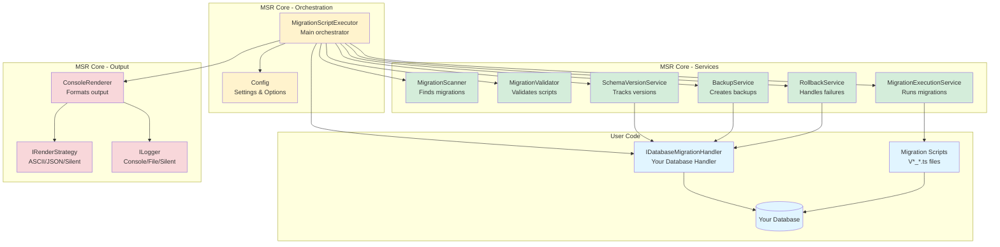

# Architecture
{: .no_toc }

Comprehensive guide to MSR's internal architecture, component design, and how the pieces fit together.
{: .fs-6 .fw-300 }

---

## Overview

MSR (Migration Script Runner) follows a layered architecture with clear separation of concerns. The system is designed around the Single Responsibility Principle, with each class handling one specific aspect of the migration workflow.

The diagram below shows the three main layers: User Code (blue), Core Orchestration (yellow), and Core Services (green), with data flow indicated by arrows:

**Architecture Layers:**
- **Blue**: User-implemented components (database handler, migrations, your database)
- **Yellow**: Orchestration layer (executor and configuration)
- **Green**: Service layer (specialized operations)
- **Red**: Output layer (rendering and logging)

### Design Principles

- **Single Responsibility** - Each class has one clear purpose
- **Dependency Injection** - Services receive dependencies through constructors
- **Interface Segregation** - Small, focused interfaces rather than large ones
- **Open/Closed** - Open for extension, closed for modification
- **Fail-Fast** - Stop execution immediately on first error

---

## Architecture Documentation

### [Core Components](components)
Detailed documentation of the main classes and services:
- MigrationScriptExecutor - Orchestration layer
- Service layer components (Backup, Schema Version, Rollback, etc.)
- Database handler interface

### [Data Flow](data-flow)
How data moves through the system:
- Migration execution workflow
- Service interaction patterns
- Data transformation pipeline

### [Lifecycle & Workflows](lifecycle)
Migration script lifecycle and workflows:
- Migration execution lifecycle
- Error handling strategy
- Recovery workflows

### [Design & Patterns](design-patterns)
Design decisions and architectural patterns:
- Dependency injection approach
- Layer responsibilities
- Extension points
- Class diagram

### [Best Practices](best-practices)
Architectural best practices and guidelines:
- Performance considerations
- Testing strategy
- Development guidelines

---

## Quick Navigation

| Topic | Description |
|-------|-------------|
| [Components](components) | Core classes and services |
| [Data Flow](data-flow) | How data moves through the system |
| [Lifecycle](lifecycle) | Migration execution lifecycle |
| [Design Patterns](design-patterns) | Architectural patterns used |
| [Best Practices](best-practices) | Performance and testing guidelines |

---

## Related Documentation

- [Development Setup](../setup) - Set up your environment
- [Development Workflow](../workflow) - Contributing process
- [Testing Guide](../testing/) - Testing standards
- [API Reference](../../api/) - Complete API documentation
