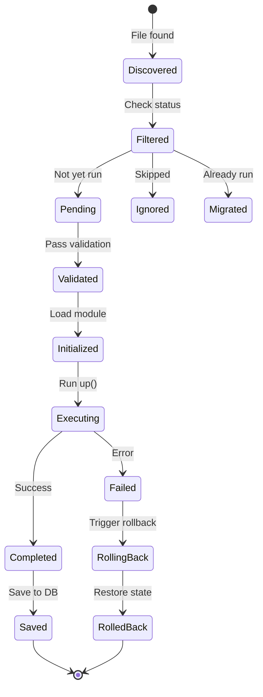

# Lifecycle & Workflows
{: .no_toc }

Migration script lifecycle and error handling workflows.
{: .fs-6 .fw-300 }

## Table of contents
{: .no_toc .text-delta }

1. TOC
{:toc}

---

## Migration Script Lifecycle

### Complete Lifecycle Diagram

This sequence diagram shows the interactions between components during the complete migration lifecycle, from initialization through execution to completion:

```mermaid
sequenceDiagram
    participant User
    participant Executor as MigrationScriptExecutor
    participant Scanner as MigrationScanner
    participant Validator as MigrationValidator
    participant Backup as BackupService
    participant Schema as SchemaVersionService
    participant Execution as MigrationExecutionService
    participant Rollback as RollbackService
    participant Renderer as MigrationRenderer

    User->>Executor: migrate()

    Note over Executor: 1. Initialization Phase
    Executor->>Schema: init()
    Schema-->>Executor: Schema table ready

    Executor->>Backup: createBackup()
    Backup-->>Executor: Backup created

    Note over Executor: 2. Discovery Phase
    Executor->>Scanner: scan(folder)
    Scanner-->>Executor: All migration files

    Executor->>Schema: list()
    Schema-->>Executor: Already migrated

    Note over Executor: 3. Validation Phase
    Executor->>Validator: validate(pending)
    Validator-->>Executor: ✅ Valid / ❌ Errors

    alt Validation Failed
        Executor->>Rollback: rollback()
        Rollback-->>Executor: Rolled back
        Executor-->>User: ❌ Failure
    end

    Note over Executor: 4. Execution Phase
    loop For each pending migration
        Executor->>Execution: execute(script)
        Note right of Execution: script.up(db, info, handler)
        Execution-->>Executor: Success

        Executor->>Schema: add(script)
        Schema-->>Executor: Saved

        alt Migration Failed
            Executor->>Rollback: rollback()
            Rollback-->>Executor: Rolled back
            Executor-->>User: ❌ Failure
        end
    end

    Note over Executor: 5. Completion Phase
    Executor->>Backup: deleteBackup()
    Backup-->>Executor: Deleted

    Executor->>Renderer: render(result)
    Renderer-->>Executor: Formatted output

    Executor-->>User: ✅ Success

    style User fill:#e3f2fd
    style Executor fill:#fff3e0
    style Scanner fill:#e8f5e9
    style Validator fill:#e8f5e9
    style Backup fill:#fff9c4
    style Schema fill:#f3e5f5
    style Execution fill:#e8f5e9
    style Rollback fill:#ffcdd2
    style Renderer fill:#e1f5fe
```

### State Transitions

This state diagram illustrates the various states a migration script can be in throughout its lifecycle, from discovery to completion or failure:



### Script Object Evolution

```typescript
// 1. Discovery (MigrationService)
{
  name: "V202311020036_create_users.ts",
  filepath: "/path/../version-migration/V202311020036_create_users.ts",
  timestamp: 202311020036,
  script: undefined  // Not loaded yet
}

// 2. Initialization (script.init())
{
  name: "V202311020036_create_users.ts",
  filepath: "/path/../version-migration/V202311020036_create_users.ts",
  timestamp: 202311020036,
  script: {
    up: async (db, info, handler) => { ... }
  }
}

// 3. Execution (MigrationRunner)
{
  name: "V202311020036_create_users.ts",
  filepath: "/path/../version-migration/V202311020036_create_users.ts",
  timestamp: 202311020036,
  username: "developer",        // ← Added
  startedAt: 1699999999000,     // ← Added
  finishedAt: 1699999999500,    // ← Added
  result: "Created 3 tables",   // ← Added (from up() return)
  script: { up: ... }
}
```

---

## Error Handling Strategy

### Fail-Fast Philosophy

MSR stops execution immediately on the first error to prevent cascading failures and maintain database consistency.

```
Script 1: ✓ Success
Script 2: ✓ Success
Script 3: ✗ FAILS
Script 4: ⊗ Not executed (stopped)
Script 5: ⊗ Not executed (stopped)

Action: Restore from backup, rollback all changes
```

### Error Flow (with Rollback Strategies)

```
try {
  // Conditional backup based on strategy
  if (strategy === BACKUP || strategy === BOTH) {
    await backup.create()
  }

  await schema.init()
  await runner.execute(scripts)  // ← Error here

  if (backupPath) {
    backup.delete()
  }
  return { success: true }

} catch (error) {
  // Handle rollback based on configured strategy
  switch (strategy) {
    case BACKUP:
      await backup.restore()
      break

    case DOWN:
      await rollbackWithDown(executedScripts)
      break

    case BOTH:
      try {
        await rollbackWithDown(executedScripts)
      } catch (downError) {
        await backup.restore()  // Fallback
      }
      break

    case NONE:
      logger.warn('No rollback configured')
      break
  }

  if (backupPath) {
    backup.delete()  // Cleanup
  }

  return {
    success: false,
    errors: [error]
  }
}
```

### Recovery Process

#### BACKUP Strategy
1. **Error Occurs** - Migration script throws exception
2. **Stop Execution** - Remaining scripts not executed
3. **Restore Backup** - Database rolled back to pre-migration state
4. **Delete Backup** - Cleanup temporary backup file
5. **Return Result** - Report failure with error details

#### DOWN Strategy
1. **Error Occurs** - Migration script throws exception
2. **Stop Execution** - Remaining scripts not executed
3. **Call down() Methods** - Execute down() on all attempted migrations in reverse order
4. **Return Result** - Report failure with error details

#### BOTH Strategy
1. **Error Occurs** - Migration script throws exception
2. **Stop Execution** - Remaining scripts not executed
3. **Try down() First** - Attempt to rollback using down() methods
4. **Fallback to Backup** - If down() fails, restore from backup
5. **Delete Backup** - Cleanup temporary backup file
6. **Return Result** - Report failure with error details

#### NONE Strategy
1. **Error Occurs** - Migration script throws exception
2. **Stop Execution** - Remaining scripts not executed
3. **Log Warning** - No rollback performed, database may be inconsistent
4. **Return Result** - Report failure with error details

---

