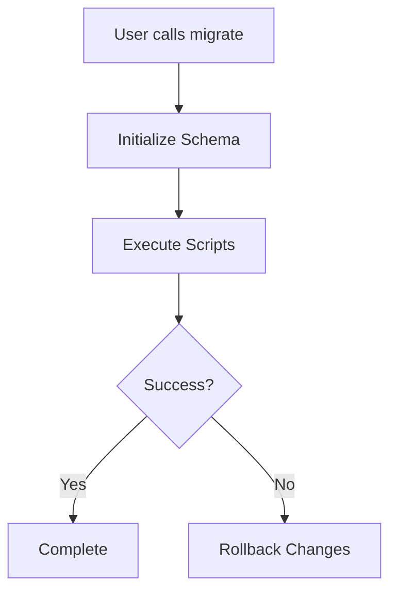
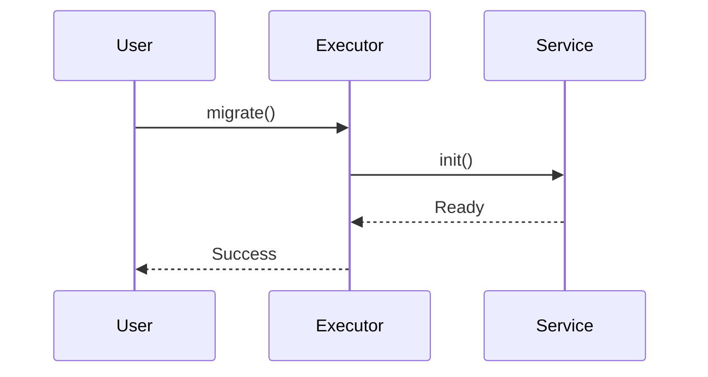
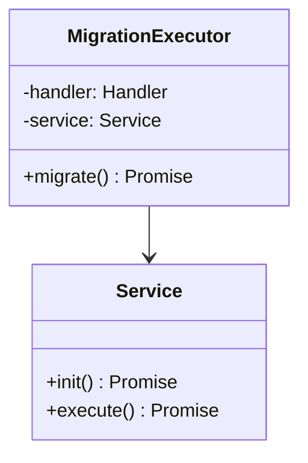
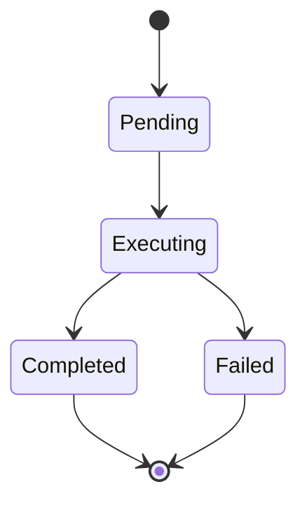
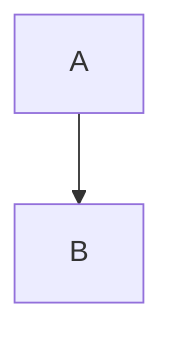

# Documentation Writing Standards
{: .no_toc }

Standards and guidelines for writing and maintaining MSR documentation.
{: .fs-6 .fw-300 }

## Table of contents
{: .no_toc .text-delta }

1. TOC
{:toc}

---

## Overview

This document defines the standards for creating and maintaining documentation in the Migration Script Runner project. Following these standards ensures consistency, professionalism, and excellent user experience.

**Audience**: Contributors writing or updating documentation.

**Goal**: Create clear, consistent, and professional documentation that helps users succeed with MSR.

---

## File Structure Standards

### Naming Conventions

**Files:**
- Use kebab-case: `custom-logging.md`, `backup-restore-workflows.md`
- Use descriptive names that match page titles
- Use `.md` extension for all documentation files

**Directories:**
- Use kebab-case: `guides/`, `version-migration/`
- Use plural for collections: `loggers/`, `render-strategies/`
- Keep directory depth to 3 levels maximum

### Organization

```
docs/
├── index.md                    # Home page
├── getting-started.md          # Quick start guide
├── guides/               # Core usage guides
│   ├── index.md
│   └── writing-migrations.md
├── api/                       # API reference (split by type)
│   ├── index.md
│   ├── core-classes.md
│   └── interfaces/            # Interfaces organized by category
│       ├── index.md
│       ├── database-handler.md
│       └── db.md
├── customization/             # Extension guides
│   ├── index.md
│   └── custom-logging.md
├── development/               # Contributor guides
│   ├── index.md
│   └── workflow.md
└── version-migration/         # Upgrade guides
    ├── index.md
    └── v2-to-v3.md
```

### YAML Front Matter

**Required fields:**
```yaml
---
layout: default
title: Page Title
nav_order: 1
---
```

**With parent section:**
```yaml
---
layout: default
title: Child Page
parent: Parent Section
nav_order: 2
---
```

**Parent section (has children):**
```yaml
---
layout: default
title: Parent Section
nav_order: 3
has_children: true
---
```

**Grandchild (3-level navigation):**
```yaml
---
layout: default
title: Grandchild Page
parent: Child Section
grand_parent: Top Section
nav_order: 1
---
```

**Rules:**
- Always use `layout: default`
- Title should match H1 heading in content
- `nav_order` determines sidebar order (lower numbers appear first)
- Use `has_children: true` only for parent sections
- Keep `nav_order` sequential (1, 2, 3, ...) within each level

---

## Content Standards

### Page Structure

**Every documentation page should have:**

1. **YAML front matter** (see above)
2. **Page title** (H1 heading with `{: .no_toc }`)
3. **Subtitle/description** (with `{: .fs-6 .fw-300 }`)
4. **Table of contents** (for pages with multiple sections)
5. **Main content** (organized with H2 sections)
6. **Horizontal separators** (`---`) between major sections

**Example:**
```markdown
---
layout: default
title: Writing Migrations
parent: User Guides
nav_order: 1
---

# Writing Migrations
{: .no_toc }

Learn how to write effective migration scripts for your database.
{: .fs-6 .fw-300 }

## Table of contents
{: .no_toc .text-delta }

1. TOC
{:toc}

---

## Overview

[Content here]

---

## Creating Your First Migration

[Content here]
```

### Headings

**Hierarchy:**
- H1 (`#`) - Page title only (one per page)
- H2 (`##`) - Major sections
- H3 (`###`) - Subsections
- H4 (`####`) - Rare, use sparingly

**Rules:**
- Use sentence case: "Writing migrations" not "Writing Migrations"
- Be descriptive: "Creating your first migration" not "First steps"
- Keep concise: 2-6 words ideal
- Never skip heading levels (H2 → H4)

### Table of Contents

**Use TOC when:**
- Page has 3+ H2 sections
- Page is longer than 200 lines
- Content benefits from quick navigation

**Standard format:**
```markdown
## Table of contents
{: .no_toc .text-delta }

1. TOC
{:toc}
```

**Rules:**
- Add `{: .no_toc }` to H1 to exclude from TOC
- TOC automatically includes H2, H3, H4 headings
- Place immediately after subtitle/description

---

## Visual Elements Standards

### Callout Boxes

Use callout boxes to highlight important information.

**Types available:**

**Note** - General information:
```markdown
{: .note }
> This is important contextual information.
```

**Tip** - Helpful advice:
```markdown
{: .tip }
> Pro tip: Use this approach for better performance.
```

**Warning** - Cautions and potential issues:
```markdown
{: .warning }
> Warning: This operation cannot be undone.
```

**When to use:**
- **Note**: Contextual information, caveats, related concepts
- **Tip**: Best practices, optimization suggestions, shortcuts
- **Warning**: Destructive operations, breaking changes, common mistakes

**Example:**
```markdown
{: .warning }
> Never use `rollbackStrategy: NONE` in production without understanding the implications.
```

### Mermaid Diagrams

Use Mermaid for visual diagrams to illustrate architecture, workflows, and data flow.

#### Mermaid Compatibility Guidelines

**IMPORTANT**: MSR documentation uses Mermaid 9.1.3, which has specific syntax requirements. Follow these rules to ensure diagrams render correctly:

**✅ DO:**
- Use simple text labels without special characters
- Use flowcharts (`graph TD/TB`) for workflows and processes
- Use sequence diagrams (`sequenceDiagram`) for component interactions
- Use class diagrams (`classDiagram`) for architecture relationships
- Use basic state diagrams (`stateDiagram`) for state transitions
- Keep diagrams focused and simple (4-6 participants max for sequence diagrams)
- Test diagrams after making changes

**❌ DON'T:**
- **No emojis** in node labels or text (❌ ✅ 🔄 etc.)
- **No dots** in method names or labels (`script.up()` → use `script up method`)
- **No parentheses** in labels unless necessary (`up()` → use `up method`)
- **No numbered lists** in Note text (`1. Phase` → use `Phase`)
- **No wildcards** in labels (`V*_*.ts` → use `V timestamp files`)
- **No slashes** in labels (`A/B` → use `A or B`)
- **No ampersands** in labels (`A & B` → use `A and B`)
- **No colons** in style declarations (avoid `style Node fill:#color`)
- **No stateDiagram-v2** (use `stateDiagram` instead)

#### Diagram Types and Examples

**Flowchart (Process Flow):**

````markdown

````

**Sequence Diagram (Component Interactions):**

Keep sequence diagrams simple with 4-6 participants maximum:

````markdown

````

**Class Diagram (Architecture):**

````markdown

````

**State Diagram (State Transitions):**

Use `stateDiagram` (not v2):

````markdown

````

#### Diagram Size Management

For large diagrams, add CSS height constraints in `docs/assets/css/custom.css`:

```css
/* Example: Limit specific diagram height */
.main-content h2#diagram-title + p + .language-mermaid {
  max-height: 600px;
  overflow-y: auto;
  border: 1px solid #e1e4e8;
  border-radius: 6px;
  padding: 16px;
}
```

**Guidelines:**
- Keep diagrams focused (5-10 nodes maximum for flowcharts)
- Use descriptive labels
- Add caption below diagram explaining what it shows
- Split complex diagrams into multiple smaller diagrams
- Test all diagrams after changes to ensure they render

**When to use:**
- Architecture overviews
- Getting started flows
- Rollback strategy comparisons
- Migration lifecycle
- Component interactions

### Comparison Tables

Use tables to compare options, strategies, or features.

**Example:**
```markdown
| Strategy | Safety | Performance | Use Case |
|----------|--------|-------------|----------|
| BACKUP   | ✅ High | ⚠️ Slower | Production (recommended) |
| DOWN     | ⚠️ Medium | ✅ Fast | Development |
| BOTH     | ✅ High | ⚠️ Slowest | Critical systems |
| NONE     | ❌ None | ✅ Fastest | Append-only systems |
```

**Guidelines:**
- Use emojis for visual quick-scanning (✅ ⚠️ ❌)
- Keep cells concise (2-5 words)
- Align columns logically
- Add explanation paragraph before table

### Labels and Badges

Use labels to mark version-specific or status information.

**Available classes:**
- `{: .label }` - Default gray label
- `{: .label .label-blue }` - Blue (informational)
- `{: .label .label-green }` - Green (success, new)
- `{: .label .label-yellow }` - Yellow (warning, deprecated)
- `{: .label .label-red }` - Red (breaking change)

**Examples:**
```markdown
New in v0.3.0
{: .label .label-green }

Deprecated
{: .label .label-yellow }

Breaking Change
{: .label .label-red }
```

**When to use:**
- Version-specific features
- Deprecated APIs
- Breaking changes
- Beta/experimental features

### Progressive Disclosure

Use `<details>` for optional/advanced content.

**Example:**
```markdown
<details>
<summary>Advanced: Custom backup implementation</summary>

For advanced use cases, you can implement custom backup logic:

\```typescript
class CustomBackup implements IBackup {
  // Implementation
}
\```

</details>
```

**When to use:**
- Advanced topics that might overwhelm beginners
- Detailed explanations of edge cases
- Verbose code examples
- Additional context that's not essential

---

## Writing Style

### Tone and Voice

**Be:**
- **Clear**: Use simple language, avoid jargon
- **Concise**: Remove unnecessary words
- **Direct**: Use active voice, imperative mood
- **Helpful**: Explain the "why" not just the "how"
- **Professional**: Maintain technical accuracy

**Avoid:**
- Marketing language ("amazing", "revolutionary")
- Excessive enthusiasm ("!!!", "wow")
- Assumptions about user knowledge
- Gendered pronouns (use "they", "you")

### Terminology

**Consistent terms:**
- "migration script" (not "migration file")
- "database handler" (not "DB adapter")
- "rollback strategy" (not "rollback mode")
- "render strategy" (not "output format")
- "schema version" (not "migration version")

**Capitalization:**
- `MigrationScriptExecutor` - class names
- `IDatabaseMigrationHandler` - interface names
- `Config` - class names
- Migration Script Runner or MSR - product name

### Code References

When referencing code in text, use inline code formatting.

**Examples:**
- Methods: "The `migrate()` method..."
- Classes: "Create a `MigrationScriptExecutor` instance..."
- Interfaces: "Implement the `IDatabaseMigrationHandler` interface..."
- Properties: "Set the `config.folder` property..."
- Types: "The function returns a `MigrationResult` object..."

**File references with line numbers:**
```
The backup implementation in src/services/BackupService.ts:42
```

---

## Code Example Standards

### Language Specification

Always specify language for syntax highlighting:

````markdown
```typescript
const executor = new MigrationScriptExecutor({ handler }, config);
```

```bash
npm install @migration-script-runner/core
```

```json
{
  "dependencies": {
    "@migration-script-runner/core": "^0.3.0"
  }
}
```
````

### Completeness

**Code examples should be:**
- **Copy-paste ready**: Work without modification
- **Complete**: Include all necessary imports
- **Type-safe**: Show proper TypeScript types
- **Realistic**: Use real-world scenarios

**Example (good):**
```typescript
import { MigrationScriptExecutor, Config } from '@migration-script-runner/core';
import { MyDatabaseHandler } from './database-handler';

const config = new Config();
config.folder = './migrations';

const handler = new MyDatabaseHandler();
const executor = new MigrationScriptExecutor({ handler }, config);

const result = await executor.migrate();
if (result.success) {
  console.log('✅ Migrations completed');
}
```

**Example (bad):**
```typescript
// Incomplete, missing imports and context
executor.migrate();
```

### Comments

Use comments to:
- Explain non-obvious code
- Highlight important concepts
- Show expected output
- Mark optional vs required code

**Example:**
```typescript
// Required: Implement getName()
getName(): string {
  return 'PostgreSQL Handler';
}

// Optional: Implement backup() for BACKUP strategy
async backup(): Promise<string> {
  // Implementation
}
```

### Output Examples

Show expected output for terminal commands:

````markdown
```bash
npm test
```

**Output:**
```
✅ All tests passed

  100 passing (2s)

Coverage: 100% Lines | 100% Branches | 100% Functions
```
````

---

## Navigation Standards

### nav_order Guidelines

**Top-level sections (recommended order):**
1. Home (index.md) - `nav_order: 1`
2. Getting Started - `nav_order: 2`
3. User Guides - `nav_order: 3`
4. API Reference - `nav_order: 4`
5. Configuration - `nav_order: 5`
6. Customization - `nav_order: 6`
7. Version Migration - `nav_order: 7`
8. License - `nav_order: 8`
9. Development - `nav_order: 10`

**Rules:**
- Use whole numbers (1, 2, 3, not 1.1, 1.2)
- Leave gaps for future additions (skip 9 for flexibility)
- Keep sequential within each section
- Update all affected pages when reordering

### Parent/Child Relationships

**Three-level maximum:**
```
Top Section (parent)
├── Child Section (parent + child)
│   ├── Grandchild Page 1
│   └── Grandchild Page 2
└── Child Page
```

**When to use children:**
- Section has 3+ related pages
- Content naturally groups together
- Reduces top-level navigation clutter

**Example:**
```yaml
# Top level
---
title: Customization
has_children: true
nav_order: 6
---

# Child level
---
title: Loggers
parent: Customization
has_children: true
nav_order: 1
---

# Grandchild level
---
title: Console Logger
parent: Loggers
grand_parent: Customization
nav_order: 1
---
```

---

## Accessibility Standards

### Alt Text

**For images:**
```markdown

```

**For diagrams:**
Add caption below explaining the diagram:
```markdown


**Caption**: This diagram shows the data flow from user request to database execution.
```

### Semantic HTML

Use proper heading hierarchy and semantic elements:

```markdown
## Section Title (H2)

### Subsection (H3)

#### Detail (H4)
```

Never skip levels (H2 → H4).

### Keyboard Navigation

Just the Docs theme handles this automatically, but ensure:
- Links have descriptive text (not "click here")
- Code examples can be selected with keyboard
- Navigation is logical top-to-bottom

---

## Common Patterns

### Recipe Page Template

````markdown
---
layout: default
title: Recipe Name
parent: Recipes
nav_order: 1
---

# Recipe Name
{: .no_toc }

Brief description of what this recipe accomplishes.
{: .fs-6 .fw-300 }

## What You'll Learn

- Key concept 1
- Key concept 2
- Key concept 3

---

## Overview

Context and use case for this recipe.

**When to use:**
- Scenario 1
- Scenario 2

---

## Implementation

Step-by-step guide with code examples.

### Step 1: Setup

```typescript
// Code here
```

### Step 2: Implementation

```typescript
// Code here
```

---

## Complete Example

Full working code:

```typescript
// Complete example
```

---

## Testing

How to test this implementation:

```bash
npm test
```

---

## Common Issues

{: .warning }
> Watch out for X when doing Y.
````

### API Reference Template

````markdown
---
layout: default
title: ClassName
parent: Core Classes
grand_parent: API Reference
nav_order: 1
---

# ClassName
{: .no_toc }

Brief description.
{: .fs-6 .fw-300 }

## Table of contents
{: .no_toc .text-delta }

1. TOC
{:toc}

---

## Overview

Detailed description of purpose and responsibility.

**Use cases:**
- Use case 1
- Use case 2

---

## Constructor

```typescript
constructor(param1: Type1, param2: Type2)
```

**Parameters:**
- `param1` (Type1) - Description
- `param2` (Type2) - Description

**Example:**
```typescript
const instance = new ClassName(arg1, arg2);
```

---

## Methods

### methodName()

Description of what the method does.

**Signature:**
```typescript
async methodName(param: string): Promise<Result>
```

**Parameters:**
- `param` (string) - Description

**Returns:**
- Promise<Result> - Description

**Throws:**
- `Error` - When X condition occurs

**Example:**
```typescript
const result = await instance.methodName('value');
```

---

## Properties

### propertyName

Description of the property.

**Type:** `string`

**Example:**
```typescript
instance.propertyName = 'value';
```
````

---

## Review Checklist

Before submitting documentation changes, verify:

**Structure:**
- [ ] YAML front matter is complete and correct
- [ ] nav_order is appropriate
- [ ] Parent/child relationships are correct
- [ ] File name matches title in kebab-case

**Content:**
- [ ] H1 title matches YAML title
- [ ] Subtitle/description is present
- [ ] TOC is included if page has 3+ sections
- [ ] Horizontal separators between major sections

**Code Examples:**
- [ ] All code blocks have language specified
- [ ] Examples are complete and runnable
- [ ] TypeScript types are shown
- [ ] Imports are included

**Style:**
- [ ] Active voice, imperative mood
- [ ] Consistent terminology
- [ ] No gendered pronouns
- [ ] Professional tone

**Visual Elements:**
- [ ] Callouts used appropriately
- [ ] Tables are formatted correctly
- [ ] Diagrams have captions
- [ ] Labels/badges are meaningful

**Links:**
- [ ] All internal links work
- [ ] External links use https://
- [ ] No broken links

**Accessibility:**
- [ ] Images have alt text
- [ ] Heading hierarchy is correct
- [ ] Links have descriptive text

---

## Questions?

If you're unsure about any documentation standard:

1. **Look at existing docs** - Find similar pages and follow their pattern
2. **Check this guide** - Re-read relevant sections
3. **Ask in issues** - Open a question on GitHub
4. **Suggest improvements** - Standards evolve, suggest changes

---

**Remember**: Good documentation is clear, consistent, and helpful. When in doubt, prioritize clarity over cleverness.
