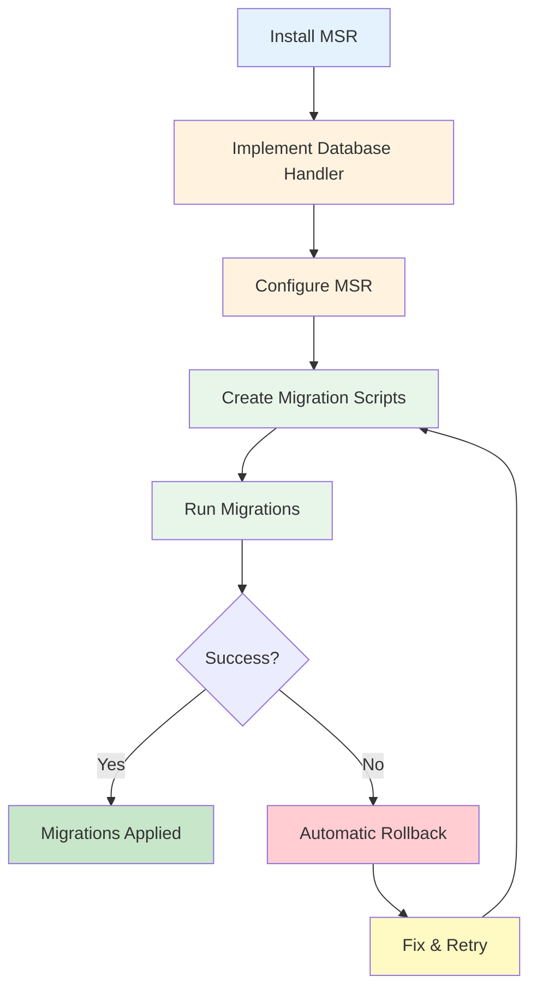

# Getting Started
{: .no_toc }

This guide will help you set up and run your first migrations with Migration Script Runner.
{: .fs-6 .fw-300 }

## What You'll Learn

- How to install and set up MSR
- Implementing a database handler for your database
- Creating your first migration script
- Running migrations and tracking execution
- Basic rollback and backup strategies

## Table of contents
{: .no_toc .text-delta }

1. TOC
{:toc}

---

## Quick Start Flow

The following diagram illustrates the complete migration workflow from installation to execution:



Follow these steps to get started with MSR.

---

## Installation

Install MSR via npm:

```bash
npm install migration-script-runner
```

Or with yarn:

```bash
yarn add migration-script-runner
```

---

## Prerequisites

- Node.js 14.x or higher
- TypeScript 4.x or higher (if using TypeScript)
- A database system you want to manage migrations for

---

## Implementing Your Database Handler

MSR is database-agnostic. You need to implement the `IDatabaseMigrationHandler` interface for your specific database:

```typescript
import { IDatabaseMigrationHandler, IMigrationInfo, IBackup, IDB, ISchemaVersion } from '@migration-script-runner/core';

export class MyDatabaseHandler implements IDatabaseMigrationHandler {

  // Your database connection
  db: IDB;

  // Schema version tracking (required)
  schemaVersion: ISchemaVersion;

  // Backup interface (optional - only needed for BACKUP or BOTH rollback strategies)
  backup?: IBackup;

  getName(): string {
    return 'MyDatabaseHandler';
  }

}
```

### IDB Implementation Example

Your `IDB` implementation must include a `checkConnection()` method (required in v0.4.0+):

```typescript
// Define your database type for type safety
interface IMyDatabase extends IDB {
  query(sql: string, params?: unknown[]): Promise<unknown[]>;
}

class MyDB implements IMyDatabase {
  constructor(private connection: any) {}

  // Required: Validate database connection
  async checkConnection(): Promise<void> {
    try {
      await this.connection.ping();
    } catch (error) {
      throw new Error(`Database connection failed: ${error.message}`);
    }
  }

  async query(sql: string, params?: unknown[]): Promise<unknown[]> {
    return await this.connection.query(sql, params);
  }
}
```

**Note:** The backup interface is now **optional**. You only need to implement it if using BACKUP or BOTH rollback strategies. For DOWN or NONE strategies, you can omit the backup implementation entirely.

---

## Creating Your First Migration Script

Create a migration file following the naming convention: `V{timestamp}_{description}.ts`

Example: `V202501220100_initial_setup.ts`

```typescript
import { IRunnableScript, IMigrationInfo, IDatabaseMigrationHandler, IDB } from '@migration-script-runner/core';

// Define your database type for type safety
interface IMyDatabase extends IDB {
  query(sql: string, params?: unknown[]): Promise<unknown[]>;
}

export default class InitialSetup implements IRunnableScript {

  async up(
    db: IMyDatabase,
    info: IMigrationInfo,
    handler: IDatabaseMigrationHandler
  ): Promise<string> {

    // Your migration logic here with full type safety
    console.log('Running initial setup...');

    // Example: create tables, insert data, etc.
    await db.query('CREATE TABLE users (id INT, name VARCHAR(255))');

    return 'Migration completed successfully';
  }

  // Optional: Implement down() for rollback without backups
  async down(
    db: IMyDatabase,
    info: IMigrationInfo,
    handler: IDatabaseMigrationHandler
  ): Promise<string> {

    // Reverse the changes made in up()
    console.log('Rolling back initial setup...');

    await db.query('DROP TABLE IF EXISTS users');

    return 'Rollback completed successfully';
  }
}
```

**Tip:** The `down()` method is optional but recommended for the DOWN rollback strategy. It allows you to rollback migrations without requiring database backups.

---

## Creating SQL Migrations (v0.4.0+)

In addition to TypeScript migrations, MSR v0.4.0+ supports SQL migration files:

**SQL Migration Example:**

```sql
-- migrations/V202501220200_create_products.up.sql
CREATE TABLE products (
    id SERIAL PRIMARY KEY,
    name VARCHAR(255) NOT NULL,
    price DECIMAL(10, 2),
    created_at TIMESTAMP DEFAULT CURRENT_TIMESTAMP
);

CREATE INDEX idx_products_name ON products(name);
```

```sql
-- migrations/V202501220200_create_products.down.sql
DROP TABLE IF EXISTS products;
```

**ISqlDB Interface:**

For SQL migrations, your database must implement `ISqlDB`:

```typescript
import { ISqlDB } from '@migration-script-runner/core';
import { Pool } from 'pg';

class PostgresDB implements ISqlDB {
  constructor(private pool: Pool) {}

  async query(sql: string): Promise<unknown> {
    const result = await this.pool.query(sql);
    return result.rows;
  }

  async checkConnection(): Promise<void> {
    await this.pool.query('SELECT 1');
  }
}
```

{: .tip }
> You can mix TypeScript and SQL migrations in the same project. Execution order is determined by timestamp only.

**Learn More:** [SQL Migrations Guide](guides/sql-migrations)

---

## Configuration

Create a configuration object to customize MSR behavior:

```typescript
import { Config, BackupConfig, RollbackStrategy } from '@migration-script-runner/core';

const config = new Config();

// Set migration scripts folder
config.folder = './migrations';

// Set filename patterns (optional) - supports multiple file types
config.filePatterns = [
  /^V(\d+)_(.+)\.ts$/,      // TypeScript migrations
  /^V(\d+)_(.+)\.up\.sql$/  // SQL migrations (v0.4.0+)
];

// Set schema version table name
config.tableName = 'schema_version';

// Configure rollback strategy (defaults to BACKUP for backward compatibility)
config.rollbackStrategy = RollbackStrategy.DOWN;  // Use down() methods

// Configure backups (only needed for BACKUP or BOTH strategies)
config.backup = new BackupConfig();
config.backup.folder = './backups';
config.backup.deleteBackup = true;
config.backup.timestamp = true;

// Configure transactions (v0.5.0+)
config.transaction.mode = TransactionMode.PER_MIGRATION;  // Per-migration transactions
config.transaction.isolation = IsolationLevel.READ_COMMITTED;
config.transaction.retries = 3;  // Retry on transient errors
```

### Rollback Strategies

MSR supports four rollback strategies:

- **`RollbackStrategy.BACKUP`** (default): Traditional backup/restore. Creates a backup before migrations and restores on failure.
- **`RollbackStrategy.DOWN`**: Calls `down()` methods on migrations in reverse order. No backup required.
- **`RollbackStrategy.BOTH`**: Tries `down()` first, falls back to backup if `down()` fails. Requires backup interface.
- **`RollbackStrategy.NONE`**: No rollback. Logs a warning and leaves database in current state.

**Example:**
```typescript
// Use down() methods for rollback (no backup needed)
config.rollbackStrategy = RollbackStrategy.DOWN;

// Use both strategies (down first, backup as fallback)
config.rollbackStrategy = RollbackStrategy.BOTH;

// No rollback (dangerous - use only in development)
config.rollbackStrategy = RollbackStrategy.NONE;
```

---

## Transaction Management (v0.5.0+)

MSR v0.5.0+ provides automatic transaction management for both SQL and NoSQL databases. Transactions ensure migrations are executed reliably with ACID guarantees.

### Basic Transaction Configuration

```typescript
import { Config, TransactionMode, IsolationLevel } from '@migration-script-runner/core';

const config = new Config();

// Enable per-migration transactions (default)
config.transaction.mode = TransactionMode.PER_MIGRATION;

// Set isolation level (SQL databases only)
config.transaction.isolation = IsolationLevel.READ_COMMITTED;

// Configure automatic retry on transient errors
config.transaction.retries = 3;
config.transaction.retryDelay = 100;  // ms
config.transaction.retryBackoff = true;  // Exponential backoff
```

### Transaction Modes

MSR supports three transaction modes:

- **`PER_MIGRATION`** (default): Each migration runs in its own transaction
- **`PER_BATCH`**: All migrations run in a single transaction
- **`NONE`**: No transaction wrapping (manual transaction management)

### Database Requirements

To use transactions, your database handler must implement either:

**SQL Databases:** `ITransactionalDB`
```typescript
import { ITransactionalDB } from '@migration-script-runner/core';

class MyDB implements ITransactionalDB {
  async checkConnection(): Promise<boolean> { /* ... */ }
  async beginTransaction(): Promise<void> { /* ... */ }
  async commit(): Promise<void> { /* ... */ }
  async rollback(): Promise<void> { /* ... */ }
  async setIsolationLevel(level: string): Promise<void> { /* ... */ }
}
```

**NoSQL Databases:** `ICallbackTransactionalDB`
```typescript
import { ICallbackTransactionalDB } from '@migration-script-runner/core';

class FirestoreDB implements ICallbackTransactionalDB<Transaction> {
  async checkConnection(): Promise<boolean> { /* ... */ }
  async runTransaction<T>(callback: (tx: Transaction) => Promise<T>): Promise<T> {
    return this.firestore.runTransaction(callback);
  }
}
```

{: .note }
> If your database doesn't implement transaction interfaces, set `config.transaction.mode = TransactionMode.NONE` to avoid validation errors.

**Learn More:** [Transaction Management Guide](guides/transaction-management)

---

## Running Migrations

### Execute Pending Migrations

MSR can be used either as a library (recommended) or as a CLI tool.

#### Library Usage (Recommended)

Use MSR as a library to integrate migrations into your application without terminating the process:

```typescript
import { MigrationScriptExecutor, IMigrationResult, Config } from '@migration-script-runner/core';

const config = new Config();
const handler = new MyDatabaseHandler();
const executor = new MigrationScriptExecutor(handler, config);

// Run migrations and get structured results
const result: IMigrationResult = await executor.up();

if (result.success) {
  console.log(`✅ Successfully executed ${result.executed.length} migrations`);
  console.log(`📋 Total migrations in database: ${result.migrated.length}`);

  if (result.ignored.length > 0) {
    console.warn(`⚠️ Ignored ${result.ignored.length} out-of-order migrations`);
  }

  // Continue with application startup
  await startApplication();
} else {
  console.error('❌ Migration failed');
  result.errors?.forEach(err => console.error(err));

  // Handle error gracefully
  await notifyAdmins(result.errors);
  process.exit(1);
}
```

#### CLI Usage

For standalone migration scripts, control the process exit based on results:

```typescript
import { MigrationScriptExecutor, Config } from '@migration-script-runner/core';

const config = new Config();
const handler = new MyDatabaseHandler();
const executor = new MigrationScriptExecutor(handler, config);

const result = await executor.up();
process.exit(result.success ? 0 : 1);
```

### List All Migrations

```typescript
// List all migrations with their status
await executor.list();

// List only the last 10 migrations
await executor.list(10);
```

---

### Version Control: Migrate to Specific Version

MSR supports controlled migration to specific versions, useful for:
- **Staged deployments** - Deploy migrations incrementally in production
- **Testing** - Test specific migration versions before full deployment
- **Rollback** - Return to a previous database version

#### Upgrade to Specific Version

```typescript
// Migrate up to specific version
const result = await executor.up(202501220300);

if (result.success) {
  console.log(`✅ Database at version 202501220300`);
  console.log(`Executed ${result.executed.length} migrations`);
} else {
  console.error('❌ Migration failed:', result.errors);
}
```

#### Downgrade to Specific Version

```typescript
// Roll back to specific version (requires down() methods)
const result = await executor.down(202501220100);

if (result.success) {
  console.log(`✅ Rolled back to version 202501220100`);
} else {
  console.error('❌ Rollback failed:', result.errors);
}
```

**Important Requirements:**
- `downTo()` requires all migrations to implement the `down()` method
- Migrations are rolled back in reverse chronological order (newest first)
- Migration records are removed from the schema version table after successful rollback

**Example Use Case - Staged Production Deployment:**
```typescript
// Week 1: Deploy first batch of migrations
await executor.up(202501220300);

// Week 2: Deploy second batch after monitoring
await executor.up(202501290500);

// If issues arise, rollback to previous version
if (issuesDetected) {
  await executor.down(202501220300);
}
```

---

## Project Structure

### Flat Structure (Traditional)

```
my-project/
├── migrations/                  # Migration scripts
│   ├── V202501220100_initial.ts
│   ├── V202501220200_add_users.ts
│   └── V202501220300_add_posts.ts
├── backups/                     # Automatic backups
├── src/
│   ├── database-handler.ts     # Your DB implementation
│   └── run-migrations.ts       # Migration runner
└── package.json
```

### Organized by Sub-folders (Recommended)

MSR supports organizing migrations into sub-folders by feature, module, or version:

```
my-project/
├── migrations/
│   ├── users/                   # User-related migrations
│   │   ├── V202501220100_create_users_table.ts
│   │   └── V202501230200_add_user_roles.ts
│   ├── auth/                    # Authentication migrations
│   │   └── V202501220150_create_sessions_table.ts
│   └── products/                # Product migrations
│       └── V202501240100_create_products_table.ts
├── backups/
└── src/
    ├── database-handler.ts
    └── run-migrations.ts
```

**Note:** Migrations execute in timestamp order regardless of folder structure:
1. `V202501220100_create_users_table.ts` (users/)
2. `V202501220150_create_sessions_table.ts` (auth/)
3. `V202501230200_add_user_roles.ts` (users/)
4. `V202501240100_create_products_table.ts` (products/)

Sub-folder scanning is enabled by default. To disable:
```typescript
config.recursive = false;
```

---

## Using beforeMigrate for Data Seeding

MSR supports a special `beforeMigrate.ts` (or `.js`) file that executes once before any migrations run, similar to Flyway's `beforeMigrate.sql`. Simply place a file named `beforeMigrate.ts` in your migrations folder - MSR will automatically detect and execute it **before** scanning for migrations.

**Important**: The beforeMigrate script runs **before migration scanning**, allowing it to completely reset or erase the database (e.g., loading a production snapshot) and then apply all migrations to that fresh state.

This special file is perfect for:

- **Data seeding**: Loading production snapshots or test data before migrations
- **Fresh database setup**: Creating database extensions, schemas, or initial structure
- **Environment-specific configuration**: Setting connection parameters, timeouts, or modes
- **Validation checks**: Ensuring database version compatibility or required prerequisites

### Example: beforeMigrate.ts for Seeding Production Snapshot

Create a file named `beforeMigrate.ts` in your migrations folder:

```typescript
// migrations/beforeMigrate.ts
import fs from 'fs';
import {IRunnableScript, IMigrationInfo, IDatabaseMigrationHandler, IDB} from 'migration-script-runner';

export default class BeforeMigrate implements IRunnableScript {
  async up(
    db: IDB,
    info: IMigrationInfo,
    handler: IDatabaseMigrationHandler
  ): Promise<string> {
    // Load production snapshot for testing/development
    if (process.env.NODE_ENV === 'development') {
      const snapshot = fs.readFileSync('./snapshots/prod_snapshot.sql', 'utf8');
      console.log('Loading production snapshot...');

      // Execute snapshot SQL (example for PostgreSQL)
      await (db as any).query(snapshot);
      console.log('✅ Production snapshot loaded');
    }

    return 'beforeMigrate setup completed';
  }
}
```

### Example: beforeMigrate.ts for PostgreSQL Extensions

```typescript
// migrations/beforeMigrate.ts
import {IRunnableScript, IMigrationInfo, IDatabaseMigrationHandler, IDB} from 'migration-script-runner';

export default class BeforeMigrate implements IRunnableScript {
  async up(
    db: IDB,
    info: IMigrationInfo,
    handler: IDatabaseMigrationHandler
  ): Promise<string> {
    // Check if this is a fresh database
    const tables = await (db as any).query(`
      SELECT COUNT(*) as count
      FROM information_schema.tables
      WHERE table_schema = 'public'
    `);

    if (tables[0].count === 0) {
      // Fresh database - create required extensions
      await (db as any).query('CREATE EXTENSION IF NOT EXISTS "uuid-ossp"');
      await (db as any).query('CREATE EXTENSION IF NOT EXISTS "pg_trgm"');
      console.log('✅ Database extensions created');
    }

    return 'beforeMigrate setup completed';
  }
}
```

### Example: beforeMigrate.ts for Environment-Specific Setup

```typescript
// migrations/beforeMigrate.ts
import {IRunnableScript, IMigrationInfo, IDatabaseMigrationHandler, IDB} from 'migration-script-runner';

export default class BeforeMigrate implements IRunnableScript {
  async up(
    db: IDB,
    info: IMigrationInfo,
    handler: IDatabaseMigrationHandler
  ): Promise<string> {
    if (process.env.NODE_ENV === 'test') {
      // Disable query timeouts for tests
      await (db as any).query('SET statement_timeout = 0');
    } else if (process.env.NODE_ENV === 'production') {
      // Enable strict mode for production
      await (db as any).query('SET sql_mode = STRICT_ALL_TABLES');
    }

    return 'Environment setup completed';
  }
}
```

### Example: beforeMigrate.ts for Version Validation

```typescript
// migrations/beforeMigrate.ts
import {IRunnableScript, IMigrationInfo, IDatabaseMigrationHandler, IDB} from 'migration-script-runner';

export default class BeforeMigrate implements IRunnableScript {
  async up(
    db: IDB,
    info: IMigrationInfo,
    handler: IDatabaseMigrationHandler
  ): Promise<string> {
    const result = await (db as any).query('SELECT version()');
    const version = result[0].version;

    const minVersion = '13.0';
    if (!this.isVersionCompatible(version, minVersion)) {
      throw new Error(
        `Database version ${version} is not compatible. ` +
        `Minimum required: ${minVersion}`
      );
    }

    return 'Version validation passed';
  }

  private isVersionCompatible(current: string, required: string): boolean {
    // Version comparison logic
    return true; // Simplified for example
  }
}
```

### Configuration

The beforeMigrate filename is configurable:

```typescript
import { Config } from 'migration-script-runner';

const config = new Config();

// Default: looks for beforeMigrate.ts or beforeMigrate.js
config.beforeMigrateName = 'beforeMigrate';

// Custom name: looks for setup.ts or setup.js
config.beforeMigrateName = 'setup';

// Disable feature entirely
config.beforeMigrateName = null;
```

### Important Notes

- `beforeMigrate.ts` is **optional** - migrations work fine without it
- It executes **once** before migration scanning (allowing it to reset the database)
- It runs **before** MSR scans for pending migrations
- Errors thrown here will **fail the migration** and trigger backup restoration
- The file follows the same structure as regular migration scripts (implements `IRunnableScript`)
- Both `.ts` and `.js` extensions are supported
- Filename is configurable via `config.beforeMigrateName`
- Can be completely disabled by setting `config.beforeMigrateName = null`

---

## Next Steps

- [Configuration Guide](configuration) - Learn about all configuration options
- [API Reference](api/) - Explore the full API
- [Writing Migrations](guides/writing-migrations) - Best practices for migration scripts
- [Testing](testing/) - How to test your migrations

---

## Troubleshooting

### Migration files not found

Make sure your `config.folder` points to the correct directory and your files match the `filePatterns`:

```typescript
config.folder = './migrations';  // Relative or absolute path
config.filePatterns = [
  /^V(\d+)_(.+)\.ts$/,      // TypeScript
  /^V(\d+)_(.+)\.up\.sql$/  // SQL (v0.4.0+)
];
```

### TypeScript compilation issues

If using TypeScript, ensure `ts-node` is installed:

```bash
npm install --save-dev ts-node
```

### Database connection errors

Verify your database handler's `init()` method properly establishes a connection before migrations run.

---

## Need Help?

- [GitHub Issues](https://github.com/vlavrynovych/msr/issues)
- [npm Package](https://www.npmjs.com/package/migration-script-runner)
