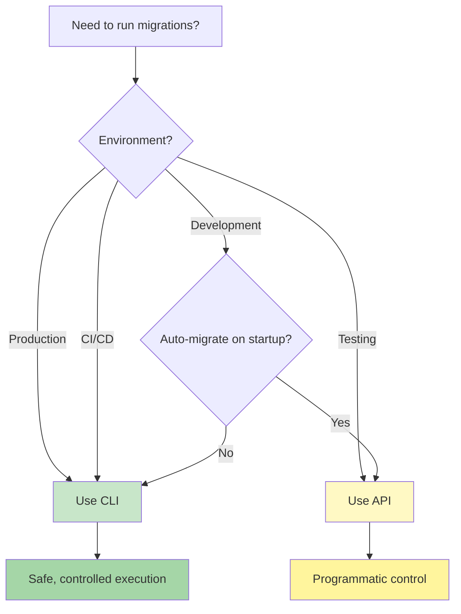

# CLI vs API: When to Use Each
{: .no_toc }

Understand when to use MSR's command-line interface versus the programmatic API for safe, reliable migrations.
{: .fs-6 .fw-300 }

## Table of Contents
{: .no_toc .text-delta }

1. TOC
{:toc}

---

## Quick Decision Guide



---

## Decision Matrix

| Scenario | Use | Why |
|----------|-----|-----|
| **Production deployment** | CLI | Controlled, auditable, single execution |
| **Staging environment** | CLI | Production-like, prevents race conditions |
| **Local development** | API | Integrated with app startup, fast iteration |
| **CI/CD pipeline** | CLI | Explicit, visible in logs, fail-fast |
| **Automated testing** | API | Programmatic control, test isolation |
| **Docker entrypoint** | CLI | Single run before app starts |
| **Kubernetes deployment** | CLI | Init container or Job, runs once |
| **Development hot-reload** | API | Automatic on code changes |
| **Manual operations** | CLI | Interactive, visible output |
| **Database seeding** | API | Programmatic data control |
| **Heroku/Railway/Render** | CLI | Release phase command |
| **Multiple app instances** | CLI | Prevents concurrent execution issues |

---

## The CLI Approach

### What is it?

The CLI approach uses MSR's command-line interface to run migrations as a separate step before starting your application.

```bash
# Run migrations via CLI
npx msr migrate

# Then start your application
npm start
```

### When to Use CLI

✅ **ALWAYS use CLI for:**

1. **Production Deployments**
   ```bash
   # Heroku release phase
   release: npx msr migrate
   ```

2. **CI/CD Pipelines**
   ```yaml
   # GitHub Actions
   - name: Run Migrations
     run: npx msr migrate
   ```

3. **Container Orchestration**
   ```yaml
   # Kubernetes init container
   initContainers:
   - name: migrations
     command: ["npx", "msr", "migrate"]
   ```

4. **Staging Environments**
   - Production-like setup
   - Multiple instances
   - Security requirements

5. **Manual Operations**
   - Schema changes during maintenance
   - Troubleshooting migrations
   - One-time data fixes

### Benefits of CLI

| Benefit | Description |
|---------|-------------|
| **🔒 Security** | App doesn't need DDL permissions (CREATE, ALTER, DROP) |
| **🎯 Control** | Explicit execution, visible in deployment logs |
| **🚫 No Race Conditions** | Single execution, no concurrent migration attempts |
| **📊 Audit Trail** | Clear record of who ran what, when |
| **🔍 Visibility** | Migration output appears in deployment logs |
| **⚡ Fast Startup** | App starts immediately, no migration delay |
| **🛡️ Rollback Safety** | Migrations separate from app code |

### CLI Example

**Dockerfile with separate migration step:**
```dockerfile
FROM node:20-alpine

WORKDIR /app
COPY package*.json ./
RUN npm ci --production

COPY . .

# Migrations run separately, not in app startup
CMD ["npm", "start"]
```

**Docker Compose:**
```yaml
services:
  migrate:
    image: myapp
    command: npx msr migrate
    environment:
      DATABASE_URL: postgres://user:pass@db:5432/mydb
    depends_on:
      - db
    restart: on-failure

  app:
    image: myapp
    command: npm start
    depends_on:
      migrate:
        condition: service_completed_successfully
    replicas: 3  # Safe to scale after migrations
```

---

## The API Approach

### What is it?

The API approach embeds migration execution directly in your application code.

```typescript
import {MigrationScriptExecutor} from '@migration-script-runner/core';

// Run migrations on app startup
const executor = new MigrationScriptExecutor({handler, config});
await executor.migrate();

// Then start your app
await startServer();
```

### When to Use API

✅ **Use API for:**

1. **Local Development**
   ```typescript
   if (process.env.NODE_ENV === 'development') {
     await executor.migrate();
   }
   ```

2. **Automated Testing**
   ```typescript
   beforeAll(async () => {
     await executor.migrate();
   });

   afterAll(async () => {
     await executor.down(0); // Rollback all
   });
   ```

3. **Database Seeding**
   ```typescript
   await executor.migrate();
   await seedDatabase(db);
   ```

4. **Development Tools**
   - Local admin panels
   - Developer utilities
   - Prototyping

### Benefits of API

| Benefit | Description |
|---------|-------------|
| **🔄 Auto-Migration** | Migrations run automatically on startup |
| **🧪 Test Control** | Programmatic setup/teardown in tests |
| **🎨 Flexibility** | Full control over migration logic |
| **📦 Embedded** | No separate migration step needed |
| **🔀 Conditional** | Run based on environment/flags |

### API Example

**Development with auto-migration:**
```typescript
import {MigrationScriptExecutor, Config} from '@migration-script-runner/core';
import {MyHandler} from './database';

async function startApp() {
  const config = new Config();
  const handler = new MyHandler();
  const executor = new MigrationScriptExecutor({handler, config});

  // Only in development
  if (process.env.NODE_ENV === 'development') {
    console.log('Running migrations...');
    const result = await executor.migrate();

    if (!result.success) {
      console.error('Migration failed:', result.errors);
      process.exit(1);
    }
  }

  // Start application
  await startServer();
}

startApp();
```

**Testing setup:**
```typescript
import {MigrationScriptExecutor} from '@migration-script-runner/core';

describe('User API', () => {
  let executor: MigrationScriptExecutor;

  beforeAll(async () => {
    executor = new MigrationScriptExecutor({handler, config});
    await executor.migrate(); // Fresh database
  });

  afterAll(async () => {
    await executor.down(0); // Clean up
  });

  it('should create user', async () => {
    // Test with migrated database
  });
});
```

---

## Common Mistakes

### ❌ DON'T: Use API in Production

**Bad - API in production with multiple instances:**
```typescript
// server.ts - DON'T DO THIS IN PRODUCTION
async function startServer() {
  // This runs on EVERY instance startup
  await executor.migrate(); // ← Race condition!

  await app.listen(3000);
}
```

**Problem:**
```
[Instance 1] Starting migrations... (00:00.000)
[Instance 2] Starting migrations... (00:00.100) ← Race!
[Instance 3] Starting migrations... (00:00.200) ← Corruption!
```

**Fix - Use CLI before deployment:**
```bash
# Deploy script
npx msr migrate  # Run once
kubectl rollout restart deployment/myapp  # Then scale
```

### ❌ DON'T: Give Production App DDL Permissions

**Bad - Over-privileged application:**
```sql
-- DON'T: Grant schema modification to app
GRANT ALL PRIVILEGES ON DATABASE mydb TO myapp_user;
```

**Problem:**
- If app is compromised, attacker can DROP tables
- Security principle: least privilege
- Increased attack surface

**Fix - Minimal permissions for app:**
```sql
-- Production app: DML only
GRANT SELECT, INSERT, UPDATE, DELETE ON ALL TABLES IN SCHEMA public TO myapp_user;

-- Migrations: DDL only (used during deployment)
GRANT CREATE, ALTER, DROP ON SCHEMA public TO migration_user;
```

### ❌ DON'T: Mix Approaches Without Guards

**Bad - Unguarded API usage:**
```typescript
// This runs in ALL environments
await executor.migrate(); // ← Dangerous in production!
await startServer();
```

**Fix - Environment guards:**
```typescript
// Only allow API in specific environments
const allowedEnvs = ['development', 'test'];
if (allowedEnvs.includes(process.env.NODE_ENV)) {
  await executor.migrate();
}

// Or explicitly disable in production
if (process.env.NODE_ENV !== 'production') {
  await executor.migrate();
}
```

---

## Platform-Specific Guidance

### Heroku

```json
// Procfile
release: npx msr migrate
web: npm start
```

✅ **Why CLI**: Release phase runs once before scaling

### Railway / Render

```json
{
  "deploy": {
    "startCommand": "npm start",
    "releaseCommand": "npx msr migrate"
  }
}
```

✅ **Why CLI**: Release command runs before instances start

### AWS ECS / Fargate

Run migrations as separate task before updating service:

```bash
# Deploy script
aws ecs run-task --task-definition myapp-migrations
aws ecs wait tasks-stopped --tasks $TASK_ARN
aws ecs update-service --service myapp --force-new-deployment
```

✅ **Why CLI**: Controlled execution before scaling

### Kubernetes

```yaml
# Use init container or Job
initContainers:
- name: migrations
  image: myapp:latest
  command: ["npx", "msr", "migrate"]
```

✅ **Why CLI**: Runs once per pod deployment

### Docker Compose

```yaml
services:
  migrate:
    image: myapp
    command: npx msr migrate
    restart: on-failure

  app:
    depends_on:
      migrate:
        condition: service_completed_successfully
```

✅ **Why CLI**: Explicit dependency, runs before app

### Vercel / Netlify (Serverless)

For serverless, consider:
- Use external migration service (GitHub Actions)
- Run migrations during build phase
- Use platform-specific hooks

```yaml
# GitHub Actions - run before deploy
- name: Run Migrations
  run: npx msr migrate
  env:
    DATABASE_URL: ${{ secrets.DATABASE_URL }}
```

✅ **Why CLI**: Serverless doesn't have "startup" phase

---

## Hybrid Approaches

### Development: API + Production: CLI

```typescript
// src/migrations.ts
export async function runMigrations() {
  const executor = new MigrationScriptExecutor({handler, config});

  // Only in development
  if (process.env.NODE_ENV === 'development') {
    console.log('Auto-running migrations (development mode)...');
    const result = await executor.migrate();

    if (!result.success) {
      throw new Error('Migrations failed: ' + result.errors?.map(e => e.message).join(', '));
    }
  }
}

// src/server.ts
async function start() {
  await runMigrations(); // No-op in production
  await startServer();
}
```

**Production deployment:**
```bash
# Separate CLI step
npx msr migrate
npm start
```

### Testing: Always API

```typescript
// test/setup.ts
export async function setupTestDatabase() {
  const executor = new MigrationScriptExecutor({handler, testConfig});
  await executor.migrate();
}

export async function teardownTestDatabase() {
  await executor.down(0);
}
```

---

## Best Practices Summary

### ✅ DO

- **Use CLI for production deployments**
- **Use CLI for staging environments**
- **Use CLI in CI/CD pipelines**
- **Use API for local development (with guards)**
- **Use API for automated tests**
- **Separate migration credentials from app credentials**
- **Run migrations before scaling instances**
- **Log migration output in deployment logs**

### ❌ DON'T

- **Don't use API in production without careful consideration**
- **Don't give production app DDL permissions**
- **Don't run migrations from multiple instances simultaneously**
- **Don't mix approaches without environment guards**
- **Don't skip migration logging**
- **Don't ignore migration failures**

---

## Quick Reference

### I want to...

| Goal | Solution |
|------|----------|
| **Deploy to production** | Use CLI in deployment pipeline |
| **Run migrations locally** | Use API with dev guard OR CLI |
| **Set up test database** | Use API in test setup |
| **Deploy to Kubernetes** | Use init container with CLI |
| **Deploy to Heroku** | Use release phase with CLI |
| **Run during CI** | Use CLI in CI step |
| **Debug migrations** | Use CLI interactively |
| **Auto-migrate on dev startup** | Use API with NODE_ENV guard |

---

## Related Documentation

- [Production Deployment Guide](production-deployment) - Detailed production patterns
- [CI/CD Integration](ci-cd-integration) - Pipeline examples
- [Docker & Kubernetes](docker-kubernetes) - Container patterns
- [CLI Adapter Development](cli-adapter-development) - Creating CLIs for adapters
- [Environment Variables](environment-variables) - Configuration options

---

## FAQ

### Q: Can I use the API in production if I'm careful?

**A**: While technically possible, it's **not recommended**. The risks outweigh the benefits:

- **Security**: App needs DDL permissions
- **Concurrency**: Hard to prevent race conditions reliably
- **Debugging**: Migration issues harder to diagnose
- **Rollback**: Complicated if migrations are embedded

**Instead**: Use CLI for production. It's safer, clearer, and follows industry best practices.

### Q: What if my platform doesn't support pre-deployment hooks?

**A**: Options:

1. **Run migrations in CI** before deploying code
2. **Use a separate migration job/task** that runs first
3. **Manual step**: Run migrations manually before deployment
4. **Init container** (Kubernetes): Runs before main container

### Q: How do I handle migrations with serverless?

**A**: Serverless is tricky because there's no "startup" phase:

1. **Best**: Run migrations in CI/CD before deployment
2. **Alternative**: Use platform hooks (build phase, pre-deploy)
3. **Last resort**: First request triggers migration (with distributed lock)

**Recommended**: Treat serverless like production - use CLI in deployment pipeline.

### Q: Can I mix CLI and API in the same project?

**A**: Yes, with proper guards:

```typescript
// Development: API
if (process.env.NODE_ENV === 'development') {
  await executor.migrate();
}

// Production: CLI (separate step)
// npx msr migrate
```

**Key**: Ensure they never run simultaneously in the same environment.

---

{: .note }
> **When in doubt, use CLI.** It's safer, more visible, and follows industry best practices for production deployments.
